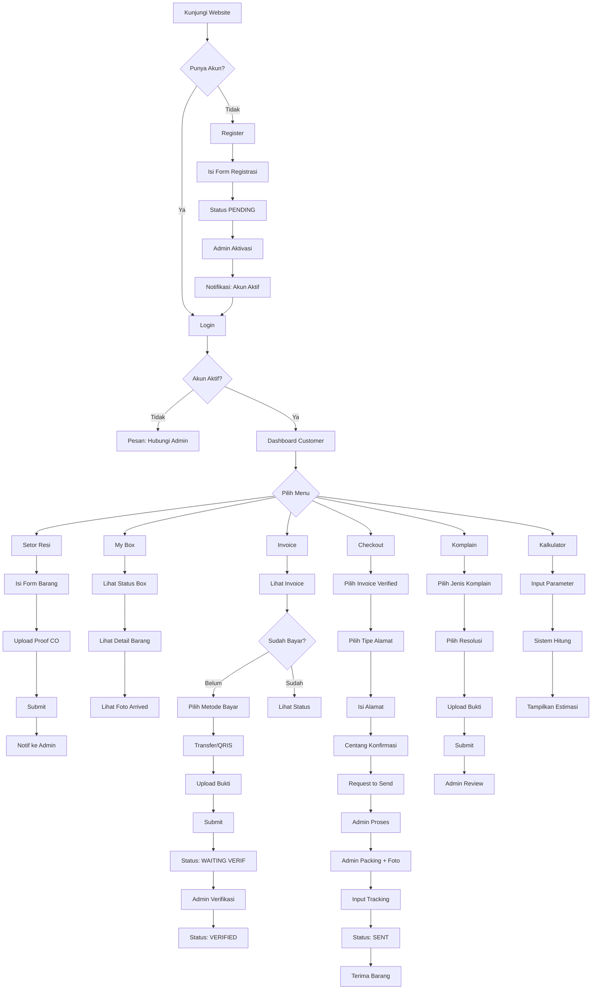
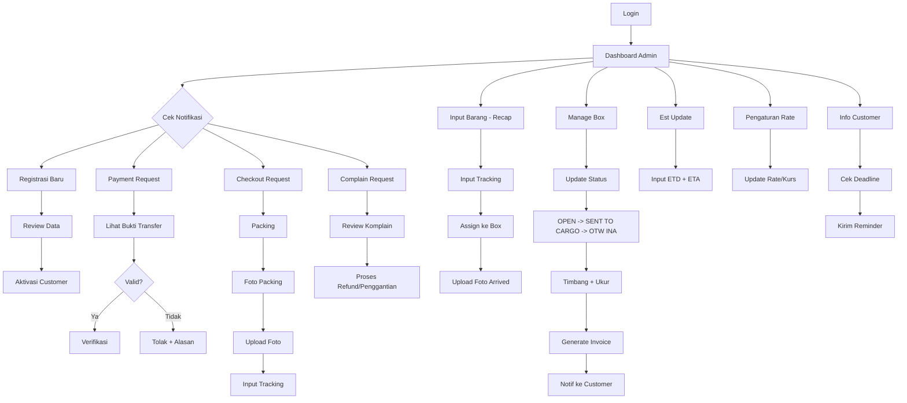
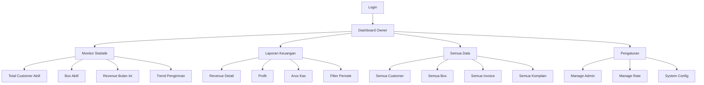
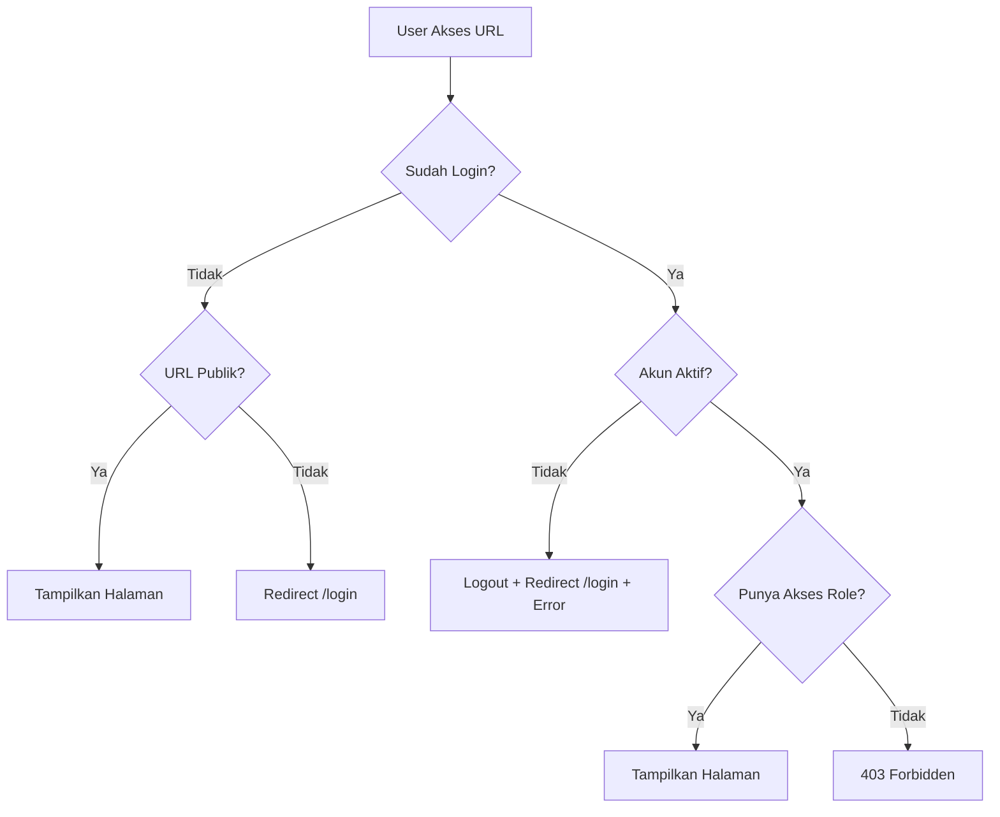
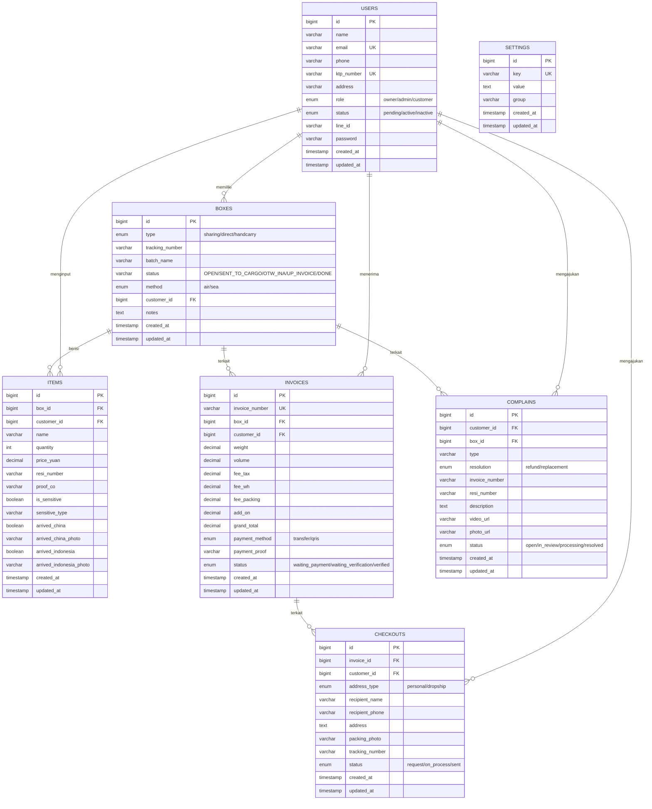

# PRODUCT REQUIREMENTS DOCUMENT (PRD)
# Ting Warehouse Management System
# Versi 2.0 — Juli 2026

---

> **Dokumen ini adalah satu-satunya acuan pengembangan aplikasi Ting Warehouse Management System dari awal hingga production. Seluruh kebutuhan bisnis, fungsional, teknis, dan operasional terdokumentasi di dalamnya.**

---

## Daftar Isi

1. [Executive Summary](#1-executive-summary)
2. [User Persona](#2-user-persona)
3. [User Role](#3-user-role)
4. [Functional Requirement](#4-functional-requirement)
5. [Non-Functional Requirement](#5-non-functional-requirement)
6. [Complete User Flow](#6-complete-user-flow)
7. [Navigation Flow](#7-navigation-flow)
8. [Screen Specification](#8-screen-specification)
9. [UI/UX Guideline](#9-uiux-guideline)
10. [Responsive Design](#10-responsive-design)
11. [Form Specification](#11-form-specification)
12. [Validation Rules](#12-validation-rules)
13. [Error Messages](#13-error-messages)
14. [Success Messages](#14-success-messages)
15. [Warning Messages](#15-warning-messages)
16. [Empty State](#16-empty-state)
17. [Loading State](#17-loading-state)
18. [Database Design](#18-database-design)
19. [API Design](#19-api-design)
20. [Security](#20-security)
21. [Tech Stack](#21-tech-stack)
22. [Folder Structure](#22-folder-structure)
23. [Coding Standard](#23-coding-standard)
24. [Testing Strategy](#24-testing-strategy)
25. [Deployment](#25-deployment)
26. [Future Roadmap](#26-future-roadmap)

---

# 1. Executive Summary

## 1.1 Latar Belakang

Ting Warehouse adalah perusahaan freight forwarding yang mengkhususkan diri dalam pengiriman barang dari China ke Jakarta. Perusahaan ini melayani berbagai jenis pengiriman melalui layanan Sharing (barang dicampur dengan customer lain), Direct (box khusus untuk satu customer), Handcarry (barang dibawa langsung), dan Dropship.

Saat ini, seluruh operasional bisnis dikelola secara manual menggunakan kombinasi **Airtable** dan **Google Sheets**. Kedua tools ini digunakan secara terpisah oleh 3 orang staff admin yang bertugas mengelola input barang, tracking status, pembuatan invoice, verifikasi pembayaran, dan pengiriman ke customer.

Penggunaan Airtable dan Google Sheets secara terpisah menimbulkan beberapa masalah serius:

1. **Data Tersebar** — Informasi barang, invoice, pembayaran, dan pengiriman berada di platform yang berbeda-beda sehingga sulit dilacak.
2. **Tidak Ada Otomasi** — Setiap proses harus dilakukan manual, mulai dari menghitung biaya, membuat invoice, hingga mengirim notifikasi ke customer.
3. **Rawan Kesalahan** — Perhitungan manual rentan terhadap human error, terutama dalam perhitungan biaya yang melibatkan konversi Yuan ke Rupiah, perhitungan berat vs volume, dan tiered pricing.
4. **Tidak Ada Akses Customer** — Customer tidak bisa melihat status barangnya secara real-time. Mereka harus menghubungi admin via LINE untuk menanyakan status.
5. **Tidak Ada Audit Trail** — Tidak ada catatan siapa yang melakukan perubahan data dan kapan.
6. **Skalabilitas Terbatas** — Semakin banyak customer, semakin sulit mengelola data secara manual.

## 1.2 Masalah yang Diselesaikan

| No | Masalah | Solusi |
|----|---------|--------|
| 1 | Data tersebar di Airtable dan Google Sheets | Satu platform terintegrasi |
| 2 | Customer tidak bisa tracking sendiri | Dashboard customer real-time |
| 3 | Perhitungan biaya manual dan rawan salah | Kalkulator otomatis dengan rate dinamis |
| 4 | Invoice dibuat manual | Generate invoice otomatis |
| 5 | Verifikasi pembayaran via LINE | Upload bukti transfer + verifikasi di sistem |
| 6 | Tidak ada notifikasi otomatis | Notifikasi status, deadline, invoice |
| 7 | Tidak ada audit trail | Log setiap perubahan data |
| 8 | Tidak ada laporan keuangan | Dashboard owner dengan laporan lengkap |
| 9 | Rate dan kurs harus dihitung manual | Rate dinamis, admin bisa update kapan saja |
| 10 | Komplain ditangani via chat | Sistem komplain terstruktur dengan bukti |

## 1.3 Tujuan Aplikasi

Membangun website operasional internal yang menggabungkan seluruh proses bisnis Ting Warehouse ke dalam satu platform terintegrasi yang dapat diakses oleh Owner, Admin, dan Customer.

## 1.4 Visi

Menjadi sistem operasional terpadu yang meningkatkan efisiensi, transparansi, dan kepuasan customer dalam layanan freight forwarding China-Jakarta.

## 1.5 Misi

1. Menggantikan Airtable dan Google Sheets dengan satu platform yang terintegrasi
2. Memberikan akses real-time kepada customer untuk tracking barang dan pembayaran
3. Mengotomasi perhitungan biaya, pembuatan invoice, dan notifikasi
4. Menyediakan laporan keuangan yang akurat untuk pengambilan keputusan bisnis
5. Membangun sistem yang skalabel untuk menampung pertumbuhan bisnis

## 1.6 Target Pengguna

| Segmentasi | Deskripsi | Estimasi Jumlah |
|------------|-----------|-----------------|
| Customer Individu | Pengguna jasa forwarding untuk kebutuhan pribadi | 50-200 orang |
| Customer Reseller | Pedagang yang mengimpor barang dari China untuk dijual kembali | 20-50 orang |
| Customer Dropship | Dropshipper yang mengirim langsung ke pembeli | 10-30 orang |
| Admin Operasional | Staff yang mengelola operasional harian | 3 orang |
| Owner | Pemilik bisnis yang memantau performa | 1 orang |

## 1.7 Target Bisnis

| Metrik | Target | Timeline |
|--------|--------|----------|
| Migrasi dari Airtable | 100% operasional di sistem baru | 3 bulan setelah launch |
| Customer aktif menggunakan sistem | 80% customer terdaftar | 2 bulan setelah launch |
| Pengurangan waktu proses invoice | Dari 30 menit menjadi 5 menit | Setelah implementasi |
| Pengurangan error perhitungan | Dari 10% menjadi <1% | Setelah implementasi |
| Customer satisfaction | Rating 4.5/5 | 6 bulan setelah launch |

## 1.8 Success Metrics

| Metrik | Formula | Target |
|--------|---------|--------|
| Adoption Rate | (Customer aktif / Total customer) × 100 | ≥ 80% |
| Invoice Accuracy | (Invoice tanpa error / Total invoice) × 100 | ≥ 99% |
| Average Processing Time | Rata-rata waktu dari input barang hingga invoice | ≤ 5 menit |
| Customer Self-Service Rate | (Transaksi via sistem / Total transaksi) × 100 | ≥ 90% |
| System Uptime | (Waktu aktif / Total waktu) × 100 | ≥ 99.5% |
| Support Ticket Reduction | Penurunan pertanyaan via LINE | ≥ 60% |

## 1.9 Scope

### In Scope (Versi 1.0)

- Autentikasi dan manajemen user (Owner, Admin, Customer)
- Dashboard untuk masing-masing role
- Input barang (setor resi) oleh customer
- Manajemen box (Sharing, Direct, Handcarry)
- Tracking status barang (OPEN → SENT TO CARGO → OTW INA → UP INVOICE → DONE)
- Perhitungan biaya otomatis (Fee TAX, Fee WH, Fee Packing)
- Generate invoice
- Upload dan verifikasi pembayaran
- Checkout dan pengiriman ke customer
- Sistem komplain dengan opsi refund/penggantian
- Kalkulator biaya di dashboard customer
- Pengaturan rate dan kurs oleh admin
- Notifikasi (in-app)
- Laporan keuangan untuk owner

### Out of Scope (Versi 1.0)

- Aplikasi mobile native (iOS/Android)
- Integrasi payment gateway (Midtrans, Xendit)
- Integrasi ekspedisi (JNE, J&T API)
- Chat/messaging antara customer dan admin
- Multi-language (Inggris)
- White-label untuk klien lain
- Automasi import data dari Airtable
- Notifikasi via WhatsApp/SMS
- Real-time WebSocket notification
- Multi-currency (selain Yuan dan Rupiah)

## 1.10 Constraints

| Constraint | Detail |
|------------|--------|
| Budget | Terbatas, menggunakan tech stack open-source |
| Timeline | Target MVP 4-6 minggu |
| Tim Developer | 1 orang fullstack developer |
| Hosting | Shared hosting atau VPS entry-level |
| Browser Support | Chrome, Safari, Firefox (versi terbaru) |
| Bahasa | Indonesia (UI), English (code) |

---

# 2. User Persona

## 2.1 Persona: Customer (Pengguna Jasa)

### Profil

| Atribut | Detail |
|---------|--------|
| **Nama** | Budi Santoso |
| **Usia** | 28-45 tahun |
| **Pekerjaan** | Pedagang online / Reseller / Dropshipper |
| **Lokasi** | Jakarta, Surabaya, Medan, kota-kota besar Indonesia |
| **Frekuensi Pengiriman** | 2-4 kali per bulan |
| **Volume** | 50-500 kg per pengiriman |

### Tujuan

1. Mengirim barang dari China ke Jakarta dengan aman dan terjangkau
2. Memantau status pengiriman secara real-time tanpa harus chat admin
3. Mengetahui estimasi biaya sebelum mengirim barang
4. Mendapat notifikasi jika ada perubahan status atau invoice baru
5. Mengajukan komplain jika ada masalah dengan barang

### Motivasi

1. Harga kompetitif dibanding ekspedisi lain
2. Kepercayaan terhadap Ting Warehouse yang sudah berpengalaman
3. Kemudahan proses dari input barang hingga penerimaan
4. Transparansi biaya dan status pengiriman

### Pain Points

1. Harus chat admin via LINE setiap kali ingin mengecek status
2. Tidak tahu estimasi biaya sebelum barang sampai Indonesia
3. Invoice sering telat karena proses manual
4. Tidak bisa melihat riwayat pengiriman sebelumnya
5. Komplain via chat sering tidak tercatat dengan baik
6. Tidak tahu kapan barang akan tiba (tidak ada estimasi)

### Device yang Digunakan

| Device | Persentase | Keterangan |
|--------|-----------|------------|
| Android (HP) | 60% | Akses utama, cek status sambil jalan |
| iPhone | 20% | Akses secondary |
| Laptop/PC | 20% | Untuk input data dan upload foto |

### Tingkat Kemampuan Teknologi

- **Level:** Menengah
- Mampu menggunakan form online dan upload foto
- Familiar dengan WhatsApp, LINE, Instagram
- Kurang paham tentang istilah teknis
- Butuh UI yang simpel dan intuitif
- Cenderung menggunakan HP dibanding laptop

---

## 2.2 Persona: Admin Operasional

### Profil

| Atribut | Detail |
|---------|--------|
| **Nama** | Siti Rahayu |
| **Usia** | 22-35 tahun |
| **Pekerjaan** | Staff operasional Ting Warehouse |
| **Lokasi** | Jakarta (kantor) dan China (gudang) |
| **Jam Kerja** | Senin-Sabtu, 09:00-18:00 WIB |
| **Jumlah** | 3 orang |

### Tujuan

1. Mengelola seluruh operasional pengiriman dari input barang hingga pengiriman ke customer
2. Menginput data barang dengan cepat dan akurat
3. Menggenerate invoice tanpa perhitungan manual
4. Memverifikasi pembayaran customer
5. Memproses checkout dan pengiriman
6. Menangani komplain customer

### Motivasi

1. Efisiensi kerja — bisa memproses lebih banyak transaksi dalam waktu sama
2. Pengurangan kesalahan — sistem membantu menghitung otomatis
3. Kemudahan tracking — bisa melihat status semua box dalam satu halaman
4. Pengurangan pertanyaan customer — customer bisa cek sendiri

### Pain Points

1. Perhitungan biaya manual memakan waktu dan rawan salah
2. Harus bolak-balik antara Airtable, Google Sheets, dan LINE
3. Customer sering menanyakan status yang sama berulang kali
4. Tidak ada sistem notifikasi — harus kirim info manual ke customer
5. Edit resi yang salah dari China harus dilakukan manual
6. Menggabungkan payment request dari beberapa invoice membingungkan

### Device yang Digunakan

| Device | Persentase | Keterangan |
|--------|-----------|------------|
| Laptop/PC | 80% | Akses utama untuk input data |
| Android (HP) | 20% | Untuk foto barang dan cek notifikasi |

### Tingkat Kemampuan Teknologi

- **Level:** Menengah-tinggi
- Mampu menggunakan web application dan spreadsheet
- Familiar dengan Airtable dan Google Sheets
- Bisa upload foto dan input data dengan cepat
- Memahami proses bisnis freight forwarding

---

## 2.3 Persona: Owner (Pemilik Bisnis)

### Profil

| Atribut | Detail |
|---------|--------|
| **Nama** | Ahmad Ting |
| **Usia** | 35-50 tahun |
| **Pekerjaan** | Pemilik Ting Warehouse |
| **Lokasi** | Jakarta / China |
| **Keterlibatan** | Strategis, tidak operasional harian |

### Tujuan

1. Memantau performa bisnis secara keseluruhan
2. Melihat laporan keuangan (revenue, profit, arus kas)
3. Mengakses semua data operasional untuk audit
4. Mengambil keputusan bisnis berdasarkan data
5. Mengelola akun admin dan pengaturan sistem

### Motivasi

1. Visibilitas penuh terhadap bisnis tanpa harus terlibat operasional
2. Data akurat untuk pengambilan keputusan
3. Transparansi operasional — tahu siapa melakukan apa
4. Pertumbuhan bisnis yang sustainable

### Pain Points

1. Tidak bisa melihat laporan keuangan secara real-time
2. Harus bertanya admin untuk mendapat update bisnis
3. Tidak ada dashboard yang menampilkan ringkasan bisnis
4. Sulit mengetahui customer mana yang paling profitable
5. Tidak ada data historis untuk analisis trend

### Device yang Digunakan

| Device | Persentase | Keterangan |
|--------|-----------|------------|
| iPhone | 50% | Cek dashboard sambil mobile |
| Laptop/PC | 50% | Analisis detail dan laporan |

### Tingkat Kemampuan Teknologi

- **Level:** Menengah
- Mampu menggunakan dashboard dan laporan
- Familiar dengan smartphone dan laptop
- Tidak ingin proses yang rumit
- Butuh informasi yang langsung actionable

---

# 3. User Role

## 3.1 Role: Customer

### Hak Akses

| Fitur | Akses | Keterangan |
|-------|-------|------------|
| Login | Ya | Email + password |
| Register | Ya | Menunggu aktivasi |
| Dashboard | Ya | Ringkasan |
| My Box Sharing | Ya | Box milik sendiri |
| My Box Direct | Ya | Box milik sendiri |
| Setor Resi | Ya | Input barang |
| Invoice | Ya | Lihat & bayar |
| Checkout | Ya | Request kirim |
| Komplain | Ya | Ajukan komplain |
| Kalkulator | Ya | Estimasi biaya |
| Generate Invoice | Tidak | Hanya admin |
| Verifikasi Bayar | Tidak | Hanya admin |
| Manage User | Tidak | Hanya owner |
| Laporan Keuangan | Tidak | Hanya owner |
| Pengaturan Rate | Tidak | Hanya admin/owner |

### Data Dapat Diakses
- Box milik sendiri, barang milik sendiri, invoice sendiri, checkout sendiri, komplain sendiri, rate terkini

### Data Tidak Dapat Diakses
- Data customer lain, data keuangan, pengaturan rate, manajemen user, log audit

### Flow
Register -> Menunggu Aktivasi -> Login -> Dashboard -> Setor Resi -> My Box -> Tunggu Invoice -> Bayar -> Upload Bukti -> Verif -> Checkout -> Isi Alamat -> Dikirim -> Terima -> (Komplain jika perlu)

---

## 3.2 Role: Admin

### Hak Akses
- Dashboard Admin, Manage Box, Recap, Update Status, Generate Invoice, Verifikasi Bayar, Proses Checkout, Handle Komplain, Info Customer, Est Update, Pengaturan Rate
- Tidak bisa: Laporan Keuangan, Manage User

### Flow
Login -> Dashboard -> Cek Notif -> Input Barang -> Update Status -> Timbang -> Generate Invoice -> Verifikasi -> Checkout -> Komplain -> Update Rate

---

## 3.3 Role: Owner

### Hak Akses
- Semua fitur Admin + Dashboard Owner, Laporan Keuangan, Semua Data, Pengaturan Sistem, Manage Admin

### Flow
Login -> Dashboard -> Laporan Keuangan -> Semua Data -> Audit -> Pengaturan -> Keputusan

---

# 4. Functional Requirement

## 4.1 FR-001: Autentikasi

### Register (/register)
**Rules:** Email unik, KTP unik, password min 8, status PENDING, admin aktivasi
**Validation:** name(required,min:3), email(required,unique), phone(required,min:10), ktp_number(required,exact:16,unique), address(required,min:10), password(required,min:8,confirmed)
**Flow:** Isi form -> Validasi -> Simpan(PENDING) -> Notif admin -> Aktivasi -> Notif customer -> Login

### Login (/login)
**Rules:** User harus aktif, session 120 menit, 5x gagal kunci 15 menit
**Flow:** Email+Password -> Validasi -> Dashboard(role)
**Alt:** PENDING="belum aktif", INACTIVE="dinonaktifkan", salah="sisa X percobaan", terkunci="coba 15 menit"

### Logout (POST /logout)
Konfirmasi -> Session hapus -> /login

### Reset Password (/forgot-password)
Isi email -> Link reset(60 menit) -> Password baru -> Login

---

## 4.2 FR-002: Dashboard Customer (/dashboard)
Komponen: Card Box Aktif, Card Invoice Unpaid, Card Goods Bulan Ini, Card Receipt Bulan Ini, Rate Display(Kurs Yuan, rate AIR/SEA), Status Box List, Notifikasi, Shortcut(My Box, Invoice, Checkout, Komplain, Kalkulator)

---

## 4.3 FR-003: My Box

### Sharing (/box/sharing)
Box tipe sharing + barang milik customer. Filter: Tracking, Tanggal, ETD, ETA, Status. Detail: nama, qty, harga, foto bukti, status arrived.

### Direct (/box/direct)
Box tipe direct milik customer, per batch. Tombol: Request Direct Sharing, Request to Close.

---

## 4.4 FR-004: Setor Resi (/setor-resi)
**Fields:** box_id(select), name(text), quantity(number), price_yuan(number), resi_number(text), proof_co(file 5MB), is_sensitive(checkbox), sensitive_type(select)
**Rules:** 1 resi per submit, harga Yuan, sensitive wajib, proof CO wajib
**Flow:** Isi form -> Upload -> Submit -> Validasi -> Simpan -> Notif admin

---

## 4.5 FR-005: Invoice & Pembayaran

### Lihat Invoice (/invoice)
Kolom: Invoice Number, Box, Weight, Volume, Fee TAX, Fee WH, Fee Packing, Grand Total, Status. Filter: Tracking, Box, Status.

### Bayar (/invoice/{id}/pay)
Fields: payment_method(Transfer/QRIS), payment_proof(file 5MB)
Flow: Pilih metode -> Transfer -> Upload bukti -> Submit -> WAITING VERIFICATION -> Admin verif -> VERIFIED

---

## 4.6 FR-006: Checkout (/checkout)
**Rules:** Invoice harus VERIFIED, pilih tipe alamat, centang konfirmasi
**Fields:** invoice_id, address_type(Personal/Dropship), recipient_name, recipient_phone, address, confirmation
**Flow:** Customer request -> Admin packing -> Foto -> Upload -> Input tracking -> SENT

---

## 4.7 FR-007: Komplain (/komplain)
**Jenis:** Kurang Barang Ekspedisi, Tidak Arrived China/Indonesia, Kurang China/Indonesia
**Resolusi:** Refund / Penggantian
**Fields:** type, resolution, invoice_number, resi_number, description, video(50MB), photo(5MB)
**Status:** OPEN -> IN REVIEW -> PROCESSING -> RESOLVED

---

## 4.8 FR-008: Kalkulator Biaya (Dashboard)
Input: method(AIR/SEA), type(Sharing/Direct), weight, P/L/T, sensitive
Rumus: Volume=(PxLxT)/6, Dasar=max(berat,volume), Fee TAX=Dasar x Rate, Fee WH=Tiered, Fee Packing=Tiered, Total=Fee TAX+WH+Packing

---

## 4.9 FR-009: Manage Box (Admin, /admin/boxes)
Status: OPEN -> SENT TO CARGO -> OTW INA -> UP INVOICE -> DONE

## 4.10 FR-010: Generate Invoice (Admin)
Pilih box OTW INA -> Input berat+dimensi -> Hitung otomatis -> Generate -> Notif customer

## 4.11 FR-011: Verifikasi (Admin, /admin/verification)
List WAITING VERIFICATION -> Lihat bukti -> Valid: VERIFIED / Tolak: alasan

## 4.12 FR-012: Pengaturan Rate (Admin, /admin/settings)
17 parameter: kurs_yuan_idr(2460), rate_sharing_air_berat(255), rate_sharing_air_volume(230), rate_sharing_sea_berat(70), rate_sharing_sea_volume(83), rate_sharing_sensitive_air_berat(315), rate_sharing_sensitive_air_volume(315), rate_sharing_sensitive_sea_berat(95), rate_sharing_sensitive_sea_volume(95), rate_direct_air_berat(230), rate_direct_air_volume(160), rate_direct_sea_berat(70), rate_direct_sea_volume(90), fee_packing_150(5000), fee_packing_1000(6500), fee_packing_2000(8000), fee_packing_extra_per_kg(1500)

## 4.13 FR-013: Laporan Keuangan (Owner, /owner/finance)
Revenue, Outstanding, Grafik bulanan, Top Customer, Arus Kas. Filter: periode, customer, status.

## 4.14 FR-014: Info Customer (Admin, /admin/customers)
Daftar customer + status + deadline payment + deadline storage + aksi(send notif, activate, deactivate)

## 4.15 FR-015: Est Update (Admin, /admin/est-update)
Form: box, ETD, ETA, notes. Tampil di dashboard customer.

## 4.16 FR-016: Recap (Admin, /admin/recap)
Input tracking -> Generate kode -> Upload foto -> Edit resi -> Data muncul di customer

---

# 5. Non-Functional Requirement

## 5.1 Security
Password: bcrypt, min 8. Session: DB, 120 min. CSRF token. XSS auto-escape. SQL Injection: Eloquent. RBAC: role middleware. File: validasi tipe+ukuran. Rate limit: 60/min/IP. HTTPS wajib.

## 5.2 Performance
Page load < 2s desktop, < 3s mobile. API < 500ms P95. DB query < 100ms. LCP < 2.5s. CLS < 0.1.

## 5.3 Availability
Uptime 99.5%. Backup DB harian, file mingguan. RTO < 4 jam. RPO < 24 jam.

## 5.4 Accessibility
WCAG AA (4.5:1 contrast), keyboard nav, alt text, min 14px font, 44x44px touch target, focus ring.

# 6. Complete User Flow

## 6.1 Customer Flow



## 6.2 Admin Flow



## 6.3 Owner Flow



---

# 7. Navigation Flow

## 7.1 Halaman Publik

| Halaman | URL | Auth Required |
|---------|-----|---------------|
| Landing Page | `/` | Tidak |
| Login | `/login` | Tidak |
| Register | `/register` | Tidak |
| Forgot Password | `/forgot-password` | Tidak |
| Reset Password | `/reset-password` | Token |

## 7.2 Halaman Customer

| Halaman | URL | Sidebar Menu |
|---------|-----|--------------|
| Dashboard | `/dashboard` | Dashboard |
| My Box Sharing | `/box/sharing` | My Box > Sharing |
| My Box Direct | `/box/direct` | My Box > Direct |
| Setor Resi | `/setor-resi` | Setor Resi |
| Invoice | `/invoice` | Invoice |
| Bayar Invoice | `/invoice/{id}/pay` | - |
| Checkout | `/checkout` | Checkout |
| Komplain | `/komplain` | Komplain |
| Komplain Baru | `/komplain/create` | - |
| Kalkulator | `/calculator` | Kalkulator |
| Profile | `/profile` | Profile |

## 7.3 Halaman Admin

| Halaman | URL | Sidebar Menu |
|---------|-----|--------------|
| Dashboard | `/admin` | Dashboard |
| Manage Boxes | `/admin/boxes` | Manage Box |
| Recap | `/admin/recap` | Recap |
| Invoices | `/admin/invoices` | Invoice |
| Generate Invoice | `/admin/invoices/create` | - |
| Verification | `/admin/verification` | Verification |
| Checkout Requests | `/admin/checkouts` | Checkout |
| Customers | `/admin/customers` | Customers |
| Complains | `/admin/complains` | Komplain |
| Est Update | `/admin/est-update` | Est Update |
| Settings | `/admin/settings` | Settings |
| Profile | `/profile` | Profile |

## 7.4 Halaman Owner

| Halaman | URL | Sidebar Menu |
|---------|-----|--------------|
| Dashboard | `/owner` | Dashboard |
| Finance | `/owner/finance` | Keuangan |
| All Data | `/owner/data` | Semua Data |
| Users | `/owner/users` | Users |
| Settings | `/owner/settings` | Settings |
| + Semua halaman Admin | `/admin/*` | - |

## 7.5 Guard & Redirect



---

# 8. Screen Specification

## 8.1 Landing Page (/)

**Tujuan:** Informasi layanan Ting Warehouse untuk pengunjung publik.

### Komponen

| Komponen | Deskripsi |
|----------|-----------|
| Header | Logo + "Ting Warehouse" + tombol Login/Register |
| Hero Section | Judul + subjudul + CTA Register |
| Layanan Section | 4 card: Sharing, Direct, Handcarry, Dropship |
| Base Operasi | Info China + Jakarta |
| Pricelist | Tabel tarif Air & Sea |
| Contact | Kontak Admin 1-4 |
| Footer | Copyright + social links |

### State

| State | Tampilan |
|-------|----------|
| Loading | Skeleton hero + skeleton cards |
| Normal | Semua section terisi |
| Error | Error illustration + retry |

---

## 8.2 Login Page (/login)

**Tujuan:** Autentikasi user.

### Komponen

| Komponen | Deskripsi |
|----------|-----------|
| Logo | Ting Warehouse logo |
| Form | Email + Password + Remember Me |
| Tombol | "Masuk" (primary) |
| Link | "Belum punya akun? Daftar" |
| Link | "Lupa Password?" |
| Error | Alert merah jika login gagal |

### State

| State | Tampilan |
|-------|----------|
| Idle | Form kosong |
| Submitting | Tombol loading + disabled |
| Error | Alert merah + pesan error |
| Success | Redirect ke dashboard |

---

## 8.3 Register Page (/register)

**Tujuan:** Pendaftaran customer baru.

### Komponen

| Komponen | Deskripsi |
|----------|-----------|
| Form | Name, Email, Phone, KTP, Address, Password, Confirm |
| Tombol | "Daftar" (primary) |
| Link | "Sudah punya akun? Masuk" |
| Alert | Info: "Akun akan diaktivasi oleh admin" |

---

## 8.4 Dashboard Customer (/dashboard)

**Tujuan:** Ringkasan aktivitas customer.

### Komponen

| Komponen | Posisi | Data |
|----------|--------|------|
| Rate Card | Top | Kurs Yuan, Rate AIR, Rate SEA |
| Invoice Unpaid Card | Top | Total belum bayar |
| Goods Card | Top | Barang bulan ini |
| Receipt Card | Top | Resi bulan ini |
| Status Box | Tengah | List box + status |
| Notifikasi | Kanan | Notifikasi terbaru |
| Shortcut | Bawah | 5 tombol menu |

### Empty State

| Komponen | Tampilan |
|----------|----------|
| Box | "Belum ada box" + CTA "Setor Resi" |
| Notifikasi | "Tidak ada notifikasi" |
| Invoice | "Belum ada invoice" |

---

## 8.5 My Box Sharing (/box/sharing)

**Tujuan:** Lihat box sharing milik customer.

### Komponen

| Komponen | Deskripsi |
|----------|-----------|
| Filter Bar | Tracking Number, Tanggal, ETD, ETA, Status |
| Box List | Card per box + status badge |
| Box Detail | Expand/collapse: daftar barang |
| Barang Row | Nama, Qty, Harga, Foto, Status Arrived |

### Empty State

"Ilustrasi box kosong" + "Belum ada barang di box sharing" + CTA "Setor Resi Sekarang"

---

## 8.6 My Box Direct (/box/direct)

**Tujuan:** Lihat box direct milik customer.

### Komponen

| Komponen | Deskripsi |
|----------|-----------|
| Filter Bar | Tracking, Batch, Status |
| Tombol | "Request Direct Sharing" |
| Batch List | Card per batch |
| Batch Detail | Daftar barang |
| Tombol per batch | "Request to Close" |

---

## 8.7 Setor Resi (/setor-resi)

**Tujuan:** Input barang baru.

### Komponen

| Komponen | Deskripsi |
|----------|-----------|
| Form | box_id, name, quantity, price_yuan, resi_number, proof_co, is_sensitive, sensitive_type |
| Preview | Preview foto sebelum submit |
| Tombol | "Submit" |
| Info Box | Info sensitive items |

---

## 8.8 Invoice Page (/invoice)

**Tujuan:** Lihat dan bayar invoice.

### Komponen

| Komponen | Deskripsi |
|----------|-----------|
| Filter | Tracking, Box, Status |
| Tabel | Invoice list dengan kolom lengkap |
| Badge | Status: WAITING PAYMENT (kuning), WAITING VERIFICATION (biru), VERIFIED (hijau) |
| Action | "Bayar" (jika WAITING PAYMENT) |

### Detail Invoice

| Komponen | Deskripsi |
|----------|-----------|
| Info | Invoice number, box, tracking |
| Rincian | Weight, Volume, Fee TAX, Fee WH, Fee Packing, Add On, Grand Total |
| Status | Badge status |
| Tombol | "Bayar Sekarang" (jika WAITING PAYMENT) |

---

## 8.9 Checkout Page (/checkout)

**Tujuan:** Request pengiriman barang.

### Komponen

| Komponen | Deskripsi |
|----------|-----------|
| Filter | Invoice Number, Status |
| List | Checkout requests + status |
| Tombol | "Request Checkout" (jika ada invoice verified) |
| Detail | Form checkout + foto packing + tracking |

---

## 8.10 Komplain Page (/komplain)

**Tujuan:** Ajukan dan track komplain.

### Komponen

| Komponen | Deskripsi |
|----------|-----------|
| Tombol | "Ajukan Komplain" |
| List | Daftar komplain + status badge |
| Detail | Jenis, resolusi, bukti, status history |

---

## 8.11 Dashboard Admin (/admin)

**Tujuan:** Ringkasan operasional admin.

### Komponen

| Komponen | Data |
|----------|------|
| Stat Sharing | Open / Closed |
| Stat Direct | Open / Closed |
| Stat Handcarry | Open / Closed |
| Notifikasi | Verification, Checkout, Complain requests |
| Customer Stats | Active / Non-active |
| Deadline | Payment, Storage |
| Shortcut | Est Update, Recap, Verification, Customer, Complain |

---

## 8.12 Manage Boxes (/admin/boxes)

### Komponen

| Komponen | Deskripsi |
|----------|-----------|
| Filter | Type, Status, Customer, Date |
| Tabel | Box list + status + customer |
| Tombol | "Tambah Box" |
| Detail | Daftar barang + status update |
| Tombol Status | "Sent to Cargo", "OTW INA", "UP INVOICE", "DONE" |

---

## 8.13 Verification Page (/admin/verification)

### Komponen

| Komponen | Deskripsi |
|----------|-----------|
| List | Invoice WAITING VERIFICATION |
| Detail | Bukti transfer (image viewer) |
| Tombol | "Verifikasi" (hijau) / "Tolak" (merah) |
| Form Tolak | Alasan penolakan |

---

## 8.14 Settings Page (/admin/settings)

### Komponen

| Komponen | Deskripsi |
|----------|-----------|
| Tab | Currency, Rate Sharing, Rate Direct, Fee Packing |
| Form per tab | Input fields dengan nilai saat ini |
| Tombol | "Simpan" per section |
| Info | "Terakhir diupdate: [tanggal]" |

---

## 8.15 Dashboard Owner (/owner)

### Komponen

| Komponen | Data |
|----------|------|
| Card Customer | Total aktif |
| Card Box | Total aktif |
| Card Revenue | Bulan ini |
| Grafik | Trend pengiriman (bar chart) |
| Notifikasi | Deadline, komplain baru |
| Recent Activity | Log aktivitas terbaru |

---

## 8.16 Laporan Keuangan (/owner/finance)

### Komponen

| Komponen | Deskripsi |
|----------|-----------|
| Summary Card | Total Revenue, Outstanding, Profit |
| Filter | Periode, Customer, Status |
| Grafik | Revenue per bulan (line chart) |
| Tabel | Detail transaksi per customer |
| Top Customer | Customer dengan transaksi terbanyak |
| Export | Tombol export Excel/CSV |

---

# 9. UI/UX Guideline

## 9.1 Design System

### Color Palette

| Warna | Hex | Penggunaan |
|-------|-----|------------|
| Primary | `#1a1a2e` | Header, sidebar, primary button |
| Primary Light | `#16213e` | Hover state |
| Accent | `#0f3460` | Link, icon aktif |
| Success | `#10b981` | Status VERIFIED, DONE |
| Warning | `#f59e0b` | Status WAITING, PENDING |
| Danger | `#ef4444` | Error, delete, tolak |
| Info | `#3b82f6` | Info, WAITING VERIFICATION |
| Background | `#f8fafc` | Halaman background |
| Surface | `#ffffff` | Card, modal |
| Text Primary | `#1e293b` | Judul, text utama |
| Text Secondary | `#64748b` | Subtitle, caption |
| Border | `#e2e8f0` | Divider, border |
| Muted | `#f1f5f9` | Background table row |

### Typography

| Elemen | Font | Size | Weight |
|--------|------|------|--------|
| H1 | Inter | 32px | 700 |
| H2 | Inter | 24px | 700 |
| H3 | Inter | 20px | 600 |
| H4 | Inter | 16px | 600 |
| Body | Inter | 14px | 400 |
| Small | Inter | 12px | 400 |
| Caption | Inter | 11px | 400 |

### Spacing

| Token | Value | Penggunaan |
|-------|-------|------------|
| xs | 4px | Gap kecil |
| sm | 8px | Padding card |
| md | 16px | Margin section |
| lg | 24px | Gap antar section |
| xl | 32px | Margin halaman |
| 2xl | 48px | Section besar |

### Border Radius

| Elemen | Radius |
|--------|--------|
| Button | 8px |
| Card | 12px |
| Input | 8px |
| Modal | 16px |
| Badge | 9999px (pill) |

### Elevation

| Level | Shadow | Penggunaan |
|-------|--------|------------|
| 0 | none | Flat |
| 1 | 0 1px 3px rgba(0,0,0,0.1) | Card |
| 2 | 0 4px 6px rgba(0,0,0,0.1) | Dropdown |
| 3 | 0 10px 15px rgba(0,0,0,0.1) | Modal |
| 4 | 0 20px 25px rgba(0,0,0,0.1) | Tooltip |

### Motion

| Animasi | Duration | Easing |
|---------|----------|--------|
| Hover | 150ms | ease-out |
| Click | 100ms | ease-in |
| Page transition | 300ms | ease-in-out |
| Modal open | 200ms | ease-out |
| Modal close | 150ms | ease-in |
| Skeleton pulse | 1.5s | ease-in-out infinite |

### Component States

| State | Button | Input | Card |
|-------|--------|-------|------|
| Default | bg-primary, text-white | bg-white, border-gray | bg-white, shadow-1 |
| Hover | bg-primary-light | border-primary | shadow-2, translateY(-2px) |
| Active | bg-primary-dark, scale-0.98 | - | - |
| Focus | ring-2 ring-primary | ring-2 ring-primary | - |
| Disabled | opacity-50, cursor-not-allowed | bg-gray, cursor-not-allowed | opacity-50 |
| Error | - | border-danger, text-danger | - |
| Loading | spinner, disabled | - | skeleton |

---

# 10. Responsive Design

## 10.1 Breakpoints

| Breakpoint | Width | Device |
|------------|-------|--------|
| xs | 320px | HP kecil |
| sm | 375px | iPhone SE |
| md | 768px | Tablet portrait |
| lg | 1024px | Tablet landscape |
| xl | 1280px | Laptop |
| 2xl | 1536px | Desktop besar |

## 10.2 Behavior per Breakpoint

### Sidebar

| Breakpoint | Behavior |
|------------|----------|
| < 1024px | Hidden, hamburger menu icon di header |
| >= 1024px | Visible, 250px width |

### Navbar

| Breakpoint | Behavior |
|------------|----------|
| < 768px | Logo + hamburger + avatar |
| >= 768px | Logo + search + notif + avatar |

### Card Grid

| Breakpoint | Columns |
|------------|---------|
| < 375px | 1 kolom |
| 375-767px | 2 kolom |
| 768-1023px | 3 kolom |
| >= 1024px | 4 kolom |

### Table

| Breakpoint | Behavior |
|------------|----------|
| < 768px | Card layout (setiap row jadi card) |
| >= 768px | Tabel normal |

### Modal

| Breakpoint | Behavior |
|------------|----------|
| < 768px | Full screen drawer (bottom sheet) |
| >= 768px | Centered modal |

### Bottom Navigation (Mobile)

| Breakpoint | Behavior |
|------------|----------|
| < 768px | Fixed bottom nav dengan 5 icon menu |
| >= 768px | Hidden (pakai sidebar) |

---

# 11. Form Specification

## 11.1 Form Register

| Field | Type | Placeholder | Required | Min | Max | Regex | Format |
|-------|------|-------------|----------|-----|-----|-------|--------|
| name | text | "Nama lengkap" | Ya | 3 | 255 | - | - |
| email | email | "email@contoh.com" | Ya | - | 255 | email | - |
| phone | tel | "08123456789" | Ya | 10 | 15 | numeric | 08xx |
| ktp_number | text | "16 digit No KTP" | Ya | 16 | 16 | numeric | - |
| address | textarea | "Alamat lengkap" | Ya | 10 | 500 | - | - |
| password | password | "Min 8 karakter" | Ya | 8 | 255 | - | - |
| password_confirmation | password | "Ulangi password" | Ya | 8 | 255 | - | sama dengan password |

## 11.2 Form Login

| Field | Type | Placeholder | Required | Min | Max |
|-------|------|-------------|----------|-----|-----|
| email | email | "Email" | Ya | - | 255 |
| password | password | "Password" | Ya | 1 | 255 |

## 11.3 Form Setor Resi

| Field | Type | Placeholder | Required | Min | Max | Format |
|-------|------|-------------|----------|-----|-----|--------|
| box_id | select | "Pilih box" | Ya | - | - | - |
| name | text | "Nama barang" | Ya | 2 | 255 | - |
| quantity | number | "Jumlah" | Ya | 1 | 9999 | Integer |
| price_yuan | number | "Harga (Yuan)" | Ya | 0.01 | 999999 | Decimal |
| resi_number | text | "No resi" | Ya | 3 | 100 | - |
| proof_co | file | "Upload foto" | Ya | - | 5MB | jpg, png, webp |
| is_sensitive | checkbox | - | - | - | - | - |
| sensitive_type | select | "Jenis sensitive" | Jika sensitive | - | - | - |

## 11.4 Form Bayar Invoice

| Field | Type | Placeholder | Required | Format |
|-------|------|-------------|----------|--------|
| payment_method | radio | - | Ya | Transfer / QRIS |
| payment_proof | file | "Upload bukti transfer" | Ya | jpg, png, max 5MB |

## 11.5 Form Checkout

| Field | Type | Placeholder | Required | Min | Max |
|-------|------|-------------|----------|-----|-----|
| invoice_id | select | "Pilih invoice" | Ya | - | - |
| address_type | radio | - | Ya | - | - |
| recipient_name | text | "Nama penerima" | Ya | 3 | 255 |
| recipient_phone | tel | "No telp" | Ya | 10 | 15 |
| address | textarea | "Alamat lengkap" | Ya | 10 | 500 |
| confirmation | checkbox | - | Ya | - | - |

## 11.6 Form Komplain

| Field | Type | Placeholder | Required | Min | Max | Format |
|-------|------|-------------|----------|-----|-----|--------|
| type | select | "Pilih jenis" | Ya | - | - | - |
| resolution | radio | - | Ya | - | - | Refund/Penggantian |
| invoice_number | text | "No invoice" | No | - | 50 | - |
| resi_number | text | "No resi" | No | - | 100 | - |
| description | textarea | "Jelaskan masalah" | Ya | 10 | 2000 | - |
| video_url | file | "Upload video" | No | - | 50MB | mp4, mov |
| photo_url | file | "Upload foto" | No | - | 5MB | jpg, png |

## 11.7 Form Generate Invoice (Admin)

| Field | Type | Placeholder | Required | Min | Max |
|-------|------|-------------|----------|-----|-----|
| box_id | select | "Pilih box" | Ya | - | - |
| weight | number | "Berat (kg)" | Ya | 0.1 | 99999 |
| length | number | "Panjang (cm)" | Ya | 1 | 999 |
| width | number | "Lebar (cm)" | Ya | 1 | 999 |
| height | number | "Tinggi (cm)" | Ya | 1 | 999 |
| add_on | number | "Biaya tambahan" | No | 0 | 999999 |

## 11.8 Form Pengaturan Rate (Admin)

| Field | Type | Required | Min | Max |
|-------|------|----------|-----|-----|
| kurs_yuan_idr | number | Ya | 1 | 99999 |
| rate_sharing_air_berat | number | Ya | 1 | 99999 |
| rate_sharing_air_volume | number | Ya | 1 | 99999 |
| rate_sharing_sea_berat | number | Ya | 1 | 99999 |
| rate_sharing_sea_volume | number | Ya | 1 | 99999 |
| rate_sharing_sensitive_air_berat | number | Ya | 1 | 99999 |
| rate_sharing_sensitive_air_volume | number | Ya | 1 | 99999 |
| rate_sharing_sensitive_sea_berat | number | Ya | 1 | 99999 |
| rate_sharing_sensitive_sea_volume | number | Ya | 1 | 99999 |
| rate_direct_air_berat | number | Ya | 1 | 99999 |
| rate_direct_air_volume | number | Ya | 1 | 99999 |
| rate_direct_sea_berat | number | Ya | 1 | 99999 |
| rate_direct_sea_volume | number | Ya | 1 | 99999 |
| fee_packing_150 | number | Ya | 0 | 999999 |
| fee_packing_1000 | number | Ya | 0 | 999999 |
| fee_packing_2000 | number | Ya | 0 | 999999 |
| fee_packing_extra_per_kg | number | Ya | 0 | 999999 |

---

# 12. Validation Rules

## 12.1 Email

| Rule | Error Message |
|------|---------------|
| required | "Email wajib diisi" |
| email format | "Format email tidak valid" |
| max:255 | "Email terlalu panjang" |
| unique:users | "Email sudah terdaftar" |

## 12.2 Password

| Rule | Error Message |
|------|---------------|
| required | "Password wajib diisi" |
| min:8 | "Password minimal 8 karakter" |
| confirmed | "Konfirmasi password tidak cocok" |

## 12.3 Nomor Telepon

| Rule | Error Message |
|------|---------------|
| required | "No telepon wajib diisi" |
| numeric | "No telepon harus angka" |
| min:10 | "No telepon minimal 10 digit" |
| max:15 | "No telepon maksimal 15 digit" |

## 12.4 No KTP

| Rule | Error Message |
|------|---------------|
| required | "No KTP wajib diisi" |
| numeric | "No KTP harus angka" |
| size:16 | "No KTP harus 16 digit" |
| unique | "No KTP sudah terdaftar" |

## 12.5 Upload File

| Rule | Error Message |
|------|---------------|
| required | "File wajib diupload" |
| mimes:jpg,png,webp | "Format file harus jpg, png, atau webp" |
| max:5120 (5MB) | "Ukuran file maksimal 5MB" |
| max:51200 (50MB) | "Ukuran video maksimal 50MB" |

## 12.6 Angka (Berat, Dimensi, Harga)

| Rule | Error Message |
|------|---------------|
| required | "Field wajib diisi" |
| numeric | "Harus berupa angka" |
| min:0.01 | "Nilai minimal 0.01" |
| max:99999 | "Nilai maksimal 99999" |

## 12.7 Nama

| Rule | Error Message |
|------|---------------|
| required | "Nama wajib diisi" |
| min:3 | "Nama minimal 3 karakter" |
| max:255 | "Nama maksimal 255 karakter" |

## 12.8 Alamat

| Rule | Error Message |
|------|---------------|
| required | "Alamat wajib diisi" |
| min:10 | "Alamat minimal 10 karakter" |
| max:500 | "Alamat maksimal 500 karakter" |

---

# 13. Error Messages

## 13.1 Autentikasi

| Kondisi | Pesan User | HTTP Code | Penyebab | Solusi |
|---------|-----------|-----------|----------|--------|
| Email kosong | "Email wajib diisi" | 422 | Form tidak diisi | Isi email |
| Password kosong | "Password wajib diisi" | 422 | Form tidak diisi | Isi password |
| Password salah | "Email atau password salah" | 401 | Kredensial salah | Cek email/password |
| Akun PENDING | "Akun belum aktif. Hubungi admin." | 403 | Belum diaktivasi | Hubungi admin |
| Akun INACTIVE | "Akun telah dinonaktifkan." | 403 | Admin menonaktifkan | Hubungi admin |
| Terkunci | "Akun terkunci. Coba lagi dalam X menit." | 429 | 5x gagal login | Tunggu 15 menit |
| Session expired | "Sesi telah berakhir. Silakan login kembali." | 401 | Timeout 120 menit | Login ulang |
| Server error | "Terjadi kesalahan. Coba beberapa saat lagi." | 500 | Server down | Coba lagi |

## 13.2 Setor Resi

| Kondisi | Pesan User | HTTP Code |
|---------|-----------|-----------|
| Resi duplikat | "Nomor resi sudah terdaftar di box [nama]" | 422 |
| Box tidak ditemukan | "Box tidak ditemukan" | 404 |
| Box sudah CLOSED | "Box sudah ditutup, tidak bisa menambah barang" | 422 |
| File terlalu besar | "Ukuran file maksimal 5MB" | 422 |
| Format file salah | "Format file harus jpg, png, atau webp" | 422 |
| Sensitive tanpa jenis | "Pilih jenis sensitive item" | 422 |

## 13.3 Invoice & Pembayaran

| Kondisi | Pesan User | HTTP Code |
|---------|-----------|-----------|
| Invoice tidak ditemukan | "Invoice tidak ditemukan" | 404 |
| Invoice sudah dibayar | "Invoice sudah dibayar" | 422 |
| Bukti transfer kosong | "Upload bukti transfer" | 422 |
| Metode tidak dipilih | "Pilih metode pembayaran" | 422 |

## 13.4 Checkout

| Kondisi | Pesan User | HTTP Code |
|---------|-----------|-----------|
| Invoice belum verified | "Invoice belum terverifikasi" | 422 |
| Checkout sudah ada | "Checkout sudah diajukan" | 422 |
| Alamat kosong | "Alamat wajib diisi" | 422 |
| Konfirmasi belum dicentang | "Centang konfirmasi terlebih dahulu" | 422 |

## 13.5 Komplain

| Kondisi | Pesan User | HTTP Code |
|---------|-----------|-----------|
| Jenis kosong | "Pilih jenis komplain" | 422 |
| Resolusi kosong | "Pilih opsi resolusi" | 422 |
| Deskripsi kosong | "Jelaskan masalah Anda" | 422 |
| Video terlalu besar | "Ukuran video maksimal 50MB" | 422 |

## 13.6 Admin

| Kondisi | Pesan User | HTTP Code |
|---------|-----------|-----------|
| Box tidak ditemukan | "Box tidak ditemukan" | 404 |
| Berat kosong | "Masukkan berat barang" | 422 |
| Dimensi kosong | "Masukkan dimensi barang" | 422 |
| Rate tidak valid | "Rate harus lebih dari 0" | 422 |
| Customer tidak ditemukan | "Customer tidak ditemukan" | 404 |

## 13.7 Sistem

| Kondisi | Pesan User | HTTP Code |
|---------|-----------|-----------|
| 404 Not Found | "Halaman tidak ditemukan" | 404 |
| 403 Forbidden | "Anda tidak memiliki akses" | 403 |
| 419 Page Expired | "Sesi expired. Refresh halaman." | 419 |
| 429 Too Many Requests | "Terlalu banyak permintaan. Coba lagi." | 429 |
| 500 Server Error | "Terjadi kesalahan server." | 500 |
| 503 Maintenance | "Sistem sedang maintenance." | 503 |

---

# 14. Success Messages

| Aksi | Pesan |
|------|-------|
| Register | "Registrasi berhasil! Menunggu aktivasi dari admin." |
| Login | "Selamat datang, [nama]!" |
| Logout | "Anda telah keluar dari sistem." |
| Setor Resi | "Barang berhasil didaftarkan." |
| Bayar Invoice | "Bukti transfer berhasil dikirim. Menunggu verifikasi admin." |
| Checkout | "Request checkout berhasil dikirim." |
| Komplain | "Komplain berhasil diajukan." |
| Update Profile | "Profil berhasil diperbarui." |
| Change Password | "Password berhasil diubah." |
| Reset Password | "Link reset password sudah dikirim ke email Anda." |
| Admin: Aktivasi | "Akun [nama] berhasil diaktivasi." |
| Admin: Generate Invoice | "Invoice [nomor] berhasil dibuat." |
| Admin: Verifikasi | "Pembayaran berhasil diverifikasi." |
| Admin: Tolak | "Bukti transfer ditolak." |
| Admin: Update Status | "Status box berhasil diupdate." |
| Admin: Update Rate | "Rate berhasil diupdate." |
| Admin: Proses Checkout | "Checkout berhasil diproses." |
| Admin: Update Estimasi | "Estimasi berhasil diupdate." |

---

# 15. Warning Messages

| Kondisi | Pesan |
|---------|-------|
| Hapus data | "Data yang dihapus tidak dapat dikembalikan. Lanjutkan?" |
| Logout | "Apakah Anda yakin ingin keluar?" |
| Session hampir habis | "Sesi akan berakhir dalam X menit. Perpanjang?" |
| Upload foto baru | "Foto sebelumnya akan diganti. Lanjutkan?" |
| Tolak pembayaran | "Pembayaran akan ditolak. Berikan alasan." |
| Nonaktifkan customer | "Customer tidak bisa login setelah dinonaktifkan." |
| Close box | "Box yang ditutup tidak bisa dibuka kembali." |
| Sensitive tidak diisi | "Barang Anda tergolong sensitive? Informasikan agar tidak kena reject." |
| Perubahan belum disimpan | "Anda memiliki perubahan yang belum disimpan. Keluar?" |

---

# 16. Empty State

| Halaman | Kondisi | Ilustrasi | Judul | CTA |
|---------|---------|-----------|-------|-----|
| Dashboard | Belum ada box | Box kosong | "Belum ada aktivitas" | "Setor Resi Sekarang" |
| My Box Sharing | Tidak ada box | Box kosong | "Belum ada barang di box sharing" | "Setor Resi" |
| My Box Direct | Tidak ada box | Box kosong | "Belum ada box direct" | "Request Direct Sharing" |
| Invoice | Tidak ada invoice | Invoice kosong | "Belum ada invoice" | - |
| Checkout | Tidak ada checkout | Paket kosong | "Belum ada checkout" | - |
| Komplain | Tidak ada komplain | Checklist kosong | "Belum ada komplain" | "Ajukan Komplain" |
| Notifikasi | Tidak ada notif | Lonceng kosong | "Tidak ada notifikasi" | - |
| Customers (Admin) | Tidak ada customer | Orang kosong | "Belum ada customer terdaftar" | - |
| Boxes (Admin) | Tidak ada box | Box kosong | "Belum ada box" | "Buat Box Baru" |
| Verification | Tidak ada payment | Centang kosong | "Tidak ada pembayaran menunggu" | - |
| Complains (Admin) | Tidak ada komplain | Checklist kosong | "Tidak ada komplain" | - |
| Laporan (Owner) | Tidak ada data | Chart kosong | "Belum ada data keuangan" | - |

---

# 17. Loading State

## 17.1 Skeleton Loader

Digunakan untuk:
- Dashboard cards (4 skeleton card)
- Tabel data (5 skeleton row)
- Box list (3 skeleton card)
- Notifikasi (3 skeleton row)

## 17.2 Spinner

Digunakan untuk:
- Tombol submit (spinner di dalam tombol)
- Page transition (spinner center screen)
- File upload (progress spinner)

## 17.3 Progress Bar

Digunakan untuk:
- File upload (progress bar 0-100%)
- Batch process (progress bar)

## 17.4 Lazy Loading

Digunakan untuk:
- Gambar (loading="lazy")
- Infinite scroll pada tabel (load more button)
- Komponen dashboard (load on visible)

---

# 18. Database Design

## 18.1 ERD (Mermaid)



## 18.2 Tabel Detail

### users

| Kolom | Tipe | PK/FK | Index | Nullable | Default |
|-------|------|-------|-------|----------|---------|
| id | bigint | PK | PRIMARY | No | auto_increment |
| name | varchar(255) | - | - | No | - |
| email | varchar(255) | - | UNIQUE | No | - |
| email_verified_at | timestamp | - | - | Ya | null |
| phone | varchar(15) | - | - | Ya | null |
| ktp_number | varchar(16) | - | UNIQUE | Ya | null |
| address | text | - | - | Ya | null |
| role | enum | - | INDEX | No | 'customer' |
| status | enum | - | INDEX | No | 'pending' |
| line_id | varchar(100) | - | - | Ya | null |
| password | varchar(255) | - | - | No | - |
| remember_token | varchar(100) | - | - | Ya | null |
| created_at | timestamp | - | - | No | current_timestamp |
| updated_at | timestamp | - | - | No | current_timestamp |

### boxes

| Kolom | Tipe | PK/FK | Index | Nullable | Default |
|-------|------|-------|-------|----------|---------|
| id | bigint | PK | PRIMARY | No | auto_increment |
| type | enum | - | INDEX | No | - |
| tracking_number | varchar(100) | - | INDEX | Ya | null |
| batch_name | varchar(100) | - | - | Ya | null |
| status | varchar(50) | - | INDEX | No | 'OPEN' |
| method | enum | - | INDEX | No | - |
| customer_id | bigint | FK→users.id | INDEX | Ya | null |
| notes | text | - | - | Ya | null |
| created_at | timestamp | - | - | No | current_timestamp |
| updated_at | timestamp | - | - | No | current_timestamp |

**Cascade:** customer_id → users.id ON DELETE SET NULL

### items

| Kolom | Tipe | PK/FK | Index | Nullable | Default |
|-------|------|-------|-------|----------|---------|
| id | bigint | PK | PRIMARY | No | auto_increment |
| box_id | bigint | FK→boxes.id | INDEX | No | - |
| customer_id | bigint | FK→users.id | INDEX | No | - |
| name | varchar(255) | - | - | No | - |
| quantity | int | - | - | No | 1 |
| price_yuan | decimal(12,2) | - | - | Ya | null |
| resi_number | varchar(100) | - | INDEX | Ya | null |
| proof_co | varchar(255) | - | - | Ya | null |
| is_sensitive | boolean | - | - | No | false |
| sensitive_type | varchar(50) | - | - | Ya | null |
| arrived_china | boolean | - | - | No | false |
| arrived_china_photo | varchar(255) | - | - | Ya | null |
| arrived_indonesia | boolean | - | - | No | false |
| arrived_indonesia_photo | varchar(255) | - | - | Ya | null |
| created_at | timestamp | - | - | No | current_timestamp |
| updated_at | timestamp | - | - | No | current_timestamp |

**Cascade:** box_id → boxes.id ON DELETE CASCADE, customer_id → users.id ON DELETE CASCADE

### invoices

| Kolom | Tipe | PK/FK | Index | Nullable | Default |
|-------|------|-------|-------|----------|---------|
| id | bigint | PK | PRIMARY | No | auto_increment |
| invoice_number | varchar(50) | - | UNIQUE | No | - |
| box_id | bigint | FK→boxes.id | INDEX | No | - |
| customer_id | bigint | FK→users.id | INDEX | No | - |
| weight | decimal(10,2) | - | - | Ya | null |
| volume | decimal(10,2) | - | - | Ya | null |
| fee_tax | decimal(12,2) | - | - | No | 0 |
| fee_wh | decimal(12,2) | - | - | No | 0 |
| fee_packing | decimal(12,2) | - | - | No | 0 |
| add_on | decimal(12,2) | - | - | No | 0 |
| grand_total | decimal(12,2) | - | - | No | 0 |
| payment_method | enum | - | - | Ya | null |
| payment_proof | varchar(255) | - | - | Ya | null |
| status | enum | - | INDEX | No | 'waiting_payment' |
| created_at | timestamp | - | - | No | current_timestamp |
| updated_at | timestamp | - | - | No | current_timestamp |

**Cascade:** box_id → boxes.id ON DELETE CASCADE, customer_id → users.id ON DELETE CASCADE

### checkouts

| Kolom | Tipe | PK/FK | Index | Nullable | Default |
|-------|------|-------|-------|----------|---------|
| id | bigint | PK | PRIMARY | No | auto_increment |
| invoice_id | bigint | FK→invoices.id | INDEX | No | - |
| customer_id | bigint | FK→users.id | INDEX | No | - |
| address_type | enum | - | - | No | - |
| recipient_name | varchar(255) | - | - | No | - |
| recipient_phone | varchar(15) | - | - | No | - |
| address | text | - | - | No | - |
| packing_photo | varchar(255) | - | - | Ya | null |
| tracking_number | varchar(100) | - | INDEX | Ya | null |
| status | enum | - | INDEX | No | 'request' |
| created_at | timestamp | - | - | No | current_timestamp |
| updated_at | timestamp | - | - | No | current_timestamp |

**Cascade:** invoice_id → invoices.id ON DELETE CASCADE, customer_id → users.id ON DELETE CASCADE

### complains

| Kolom | Tipe | PK/FK | Index | Nullable | Default |
|-------|------|-------|-------|----------|---------|
| id | bigint | PK | PRIMARY | No | auto_increment |
| customer_id | bigint | FK→users.id | INDEX | No | - |
| box_id | bigint | FK→boxes.id | INDEX | Ya | null |
| type | varchar(100) | - | - | No | - |
| resolution | enum | - | - | No | - |
| invoice_number | varchar(50) | - | - | Ya | null |
| resi_number | varchar(100) | - | - | Ya | null |
| description | text | - | - | Ya | null |
| video_url | varchar(255) | - | - | Ya | null |
| photo_url | varchar(255) | - | - | Ya | null |
| status | enum | - | INDEX | No | 'open' |
| created_at | timestamp | - | - | No | current_timestamp |
| updated_at | timestamp | - | - | No | current_timestamp |

**Cascade:** customer_id → users.id ON DELETE CASCADE, box_id → boxes.id ON DELETE SET NULL

### settings

| Kolom | Tipe | PK/FK | Index | Nullable | Default |
|-------|------|-------|-------|----------|---------|
| id | bigint | PK | PRIMARY | No | auto_increment |
| key | varchar(100) | - | UNIQUE | No | - |
| value | text | - | - | Ya | null |
| group | varchar(50) | - | INDEX | No | 'general' |
| created_at | timestamp | - | - | No | current_timestamp |
| updated_at | timestamp | - | - | No | current_timestamp |

---

# 19. API Design

## 19.1 Autentikasi

| Endpoint | Method | Auth | Description |
|----------|--------|------|-------------|
| `/api/register` | POST | No | Register customer |
| `/api/login` | POST | No | Login |
| `/api/logout` | POST | Yes | Logout |
| `/api/forgot-password` | POST | No | Request reset |
| `/api/reset-password` | POST | No | Reset password |
| `/api/me` | GET | Yes | Current user info |

## 19.2 Customer

| Endpoint | Method | Auth | Description |
|----------|--------|------|-------------|
| `/api/dashboard` | GET | Customer | Dashboard data |
| `/api/boxes` | GET | Customer | My boxes |
| `/api/boxes/{id}` | GET | Customer | Box detail |
| `/api/items` | POST | Customer | Setor resi |
| `/api/invoices` | GET | Customer | My invoices |
| `/api/invoices/{id}` | GET | Customer | Invoice detail |
| `/api/invoices/{id}/pay` | POST | Customer | Pay invoice |
| `/api/checkouts` | POST | Customer | Request checkout |
| `/api/complains` | GET | Customer | My complains |
| `/api/complains` | POST | Customer | Create complain |
| `/api/calculator` | POST | Customer | Hitung estimasi |
| `/api/notifications` | GET | Customer | My notifications |
| `/api/settings/rates` | GET | Customer | Current rates |

## 19.3 Admin

| Endpoint | Method | Auth | Description |
|----------|--------|------|-------------|
| `/api/admin/dashboard` | GET | Admin | Dashboard data |
| `/api/admin/boxes` | GET/POST | Admin | List/create boxes |
| `/api/admin/boxes/{id}` | PUT | Admin | Update box |
| `/api/admin/boxes/{id}/status` | PUT | Admin | Update status |
| `/api/admin/items` | POST | Admin | Input barang (recap) |
| `/api/admin/items/{id}` | PUT | Admin | Update item |
| `/api/admin/invoices` | GET | Admin | All invoices |
| `/api/admin/invoices` | POST | Admin | Generate invoice |
| `/api/admin/verification` | GET | Admin | Pending payments |
| `/api/admin/verification/{id}` | PUT | Admin | Verify/reject |
| `/api/admin/checkouts` | GET | Admin | Checkout requests |
| `/api/admin/checkouts/{id}` | PUT | Admin | Process checkout |
| `/api/admin/customers` | GET | Admin | Customer list |
| `/api/admin/customers/{id}` | PUT | Admin | Update customer |
| `/api/admin/complains` | GET | Admin | All complains |
| `/api/admin/complains/{id}` | PUT | Admin | Update complain |
| `/api/admin/settings` | GET/PUT | Admin | Settings |
| `/api/admin/est-update` | POST | Admin | Update ETA/ETD |

## 19.4 Owner

| Endpoint | Method | Auth | Description |
|----------|--------|------|-------------|
| `/api/owner/dashboard` | GET | Owner | Dashboard data |
| `/api/owner/finance` | GET | Owner | Financial report |
| `/api/owner/data` | GET | Owner | All data |
| `/api/owner/users` | GET/PUT | Owner | Manage users |

## 19.5 Response Format

### Success Response
```json
{
    "success": true,
    "message": "Pesan sukses",
    "data": { ... }
}
```

### Error Response
```json
{
    "success": false,
    "message": "Pesan error",
    "errors": {
        "field": ["Error message"]
    }
}
```

### Paginated Response
```json
{
    "success": true,
    "data": [ ... ],
    "meta": {
        "current_page": 1,
        "last_page": 5,
        "per_page": 15,
        "total": 75
    }
}
```

---

# 20. Security

## 20.1 Authentication

| Aspek | Implementasi |
|-------|-------------|
| Token | Laravel Session (database driver) |
| Password | bcrypt hash |
| Session Lifetime | 120 menit |
| Session Regenerate | Setelah login |
| Remember Me | Cookie-based (optional) |

## 20.2 Authorization (RBAC)

| Aspek | Implementasi |
|-------|-------------|
| Method | Role Middleware |
| Roles | owner, admin, customer |
| Enforcement | Route middleware + controller check |

## 20.3 Input Security

| Aspek | Implementasi |
|-------|-------------|
| CSRF | Token di setiap form POST/PUT/DELETE |
| XSS | Blade auto-escape {{ }} |
| SQL Injection | Eloquent ORM + parameter binding |
| File Upload | Validasi tipe, ukuran, rename |

## 20.4 Headers

| Header | Value |
|--------|-------|
| X-Content-Type-Options | nosniff |
| X-Frame-Options | SAMEORIGIN |
| X-XSS-Protection | 1; mode=block |
| Referrer-Policy | strict-origin-when-cross-origin |

## 20.5 Rate Limiting

| Endpoint | Limit |
|----------|-------|
| Login | 5 attempts per 15 menit |
| Register | 3 attempts per jam |
| API | 60 requests per menit |

---

# 21. Tech Stack

## 21.1 Frontend

| Technology | Version | Alasan |
|------------|---------|--------|
| Blade | Built-in | Template engine Laravel, cepat dan maintainable |
| Livewire | v3 | Interaksi real-time tanpa API terpisah |
| Tailwind CSS | v4.0 | Utility-first, cepat develop UI |
| Alpine.js | Built-in | Interaksi ringan (dropdown, modal, toggle) |

## 21.2 Backend

| Technology | Version | Alasan |
|------------|---------|--------|
| PHP | 8.5 | Bahasa utama, performa tinggi |
| Laravel | 12 | Framework PHP terpopuler, ekosistem lengkap |
| Eloquent | Built-in | ORM yang powerful dan intuitive |

## 21.3 Database

| Technology | Version | Alasan |
|------------|---------|--------|
| MySQL | 8.0 | Relational DB, cocok untuk data terstruktur |

## 21.4 Storage

| Technology | Alasan |
|------------|--------|
| Local Storage (V1) | Simpel, cukup untuk MVP |
| S3-compatible (V2) | Scalable untuk production |

## 21.5 Cache

| Technology | Alasan |
|------------|--------|
| File Cache (V1) | Simpel untuk MVP |
| Redis (V2) | Lebih cepat untuk production |

## 21.6 Queue

| Technology | Alasan |
|------------|--------|
| Database Queue (V1) | Simpel, tidak perlu infra tambahan |
| Redis Queue (V2) | Lebih cepat untuk production |

## 21.7 Authentication

| Technology | Alasan |
|------------|--------|
| Laravel Breeze | Auth scaffold cepat dan lengkap |
| Session-based | Cocok untuk web application |

## 21.8 Deployment

| Technology | Alasan |
|------------|--------|
| Shared Hosting / VPS | Budget-friendly untuk startup |

---

# 22. Folder Structure

```
ting-warehouse/
├── app/
│   ├── Http/
│   │   ├── Controllers/
│   │   │   ├── Auth/              # Login, Register, Reset Password
│   │   │   ├── Customer/          # Dashboard, Box, Invoice, Checkout, Komplain
│   │   │   ├── Admin/             # Dashboard, Box, Invoice, Verification, Settings
│   │   │   └── Owner/             # Dashboard, Finance, Data, Users
│   │   ├── Middleware/
│   │   │   └── RoleMiddleware.php # Role checking
│   │   └── Requests/              # Form Request validation
│   ├── Livewire/                  # Livewire components
│   │   ├── Customer/              # Dashboard widgets, Kalkulator
│   │   ├── Admin/                 # Settings form, Status update
│   │   └── Shared/                # Notifications, Rate display
│   └── Models/
│       ├── User.php
│       ├── Box.php
│       ├── Item.php
│       ├── Invoice.php
│       ├── Checkout.php
│       ├── Complain.php
│       └── Setting.php
├── database/
│   ├── migrations/                # Database migrations
│   └── seeders/                   # Default data
├── resources/
│   ├── views/
│   │   ├── layouts/               # Base layout
│   │   ├── components/            # Blade components
│   │   ├── customer/              # Customer views
│   │   ├── admin/                 # Admin views
│   │   ├── owner/                 # Owner views
│   │   ├── auth/                  # Auth views
│   │   └── livewire/              # Livewire views
│   └── css/
│       └── app.css                # Tailwind CSS
├── routes/
│   ├── web.php                    # Web routes
│   ├── auth.php                   # Auth routes
│   ├── customer.php               # Customer routes
│   ├── admin.php                  # Admin routes
│   └── owner.php                  # Owner routes
└── public/
    └── storage/                   # Uploaded files
```

---

# 23. Coding Standard

## 23.1 Naming Convention

| Elemen | Convention | Contoh |
|--------|-----------|--------|
| Controller | PascalCase + Controller | BoxController, InvoiceController |
| Model | PascalCase | Box, Invoice, User |
| Migration | snake_case | create_boxes_table |
| Route | kebab-case | /admin/manage-boxes |
| View | kebab-case | customer.dashboard |
| Variable | camelCase | $grandTotal, $feeTax |
| Method | camelCase | getGrandTotal(), calculateFee() |
| Constant | UPPER_SNAKE_CASE | STATUS_OPEN, ROLE_ADMIN |
| Table | snake_case, plural | boxes, invoices, items |
| Column | snake_case | grand_total, fee_tax |

## 23.2 Principles

- **SOLID** — Single Responsibility, Open-Closed, Liskov Substitution, Interface Segregation, Dependency Inversion
- **DRY** — Don't Repeat Yourself, gunakan trait, helper, component
- **KISS** — Keep It Simple, jangan over-engineer
- **Clean Architecture** — Pisahkan business logic dari presentation

---

# 24. Testing Strategy

## 24.1 Unit Test

| Test | Target |
|------|--------|
| Model relationship | User→Boxes, Box→Items, Invoice→Checkouts |
| Calculation | Fee TAX, Fee WH, Fee Packing, Volume |
| Role check | isOwner(), isAdmin(), isCustomer() |
| Setting | get(), set() |

## 24.2 Feature Test

| Test | Target |
|------|--------|
| Register | Valid/invalid input, email duplikat, KTP duplikat |
| Login | Valid/invalid, PENDING, INACTIVE, terkunci |
| Setor Resi | Valid/invalid, resi duplikat, file upload |
| Invoice | Generate, pay, verify |
| Checkout | Create, process |
| Komplain | Create, update status |
| Rate Settings | Update rate |

## 24.3 Manual Testing Checklist

- [ ] Register → Login → Dashboard
- [ ] Setor Resi → Lihat di My Box
- [ ] Admin: Generate Invoice → Customer bayar → Admin verifikasi
- [ ] Customer: Checkout → Admin proses → Tracking
- [ ] Customer: Komplain → Admin proses
- [ ] Admin: Update Rate → Kalkulator update
- [ ] Owner: Lihat laporan keuangan
- [ ] Responsive: 375px, 768px, 1024px, 1440px

---

# 25. Deployment

## 25.1 Development

- **Environment:** Local (Laravel Sail / Valet)
- **Database:** MySQL local
- **URL:** http://localhost:8000

## 25.2 Production

- **Server:** VPS (Ubuntu 22.04+)
- **Web Server:** Nginx
- **PHP:** 8.5 FPM
- **Database:** MySQL 8.0
- **SSL:** Let's Encrypt
- **URL:** https://www.tingwarehouse.my.id

## 25.3 Deployment Steps

1. Clone repo ke server
2. `composer install --no-dev`
3. `npm run build`
4. `php artisan migrate --force`
5. `php artisan db:seed --force`
6. `php artisan config:cache`
7. `php artisan route:cache`
8. `php artisan view:cache`
9. Setup Nginx config
10. Setup SSL

## 25.4 Backup

| Item | Frequency | Method |
|------|-----------|--------|
| Database | Harian | mysqldump cron |
| File Upload | Mingguan | rsync/S3 sync |
| Code | Setiap deploy | Git |

## 25.5 Rollback

1. `git revert` ke commit sebelumnya
2. `composer install`
3. `php artisan migrate:rollback` (jika ada migration baru)
4. `php artisan config:clear && cache:clear`
5. Restart PHP-FPM

---

# 26. Future Roadmap

## Version 1.0 (MVP)

- Autentikasi multi-role
- Dashboard per role
- Setor Resi
- Manage Box
- Generate Invoice
- Verifikasi Pembayaran
- Checkout
- Komplain
- Kalkulator Biaya
- Pengaturan Rate
- Laporan Keuangan

## Version 1.5

- Notifikasi email otomatis
- Export laporan ke Excel/PDF
- Bulk input barang
- History perubahan harga
- Customer rating sistem

## Version 2.0

- Aplikasi mobile (Flutter)
- Notifikasi push
- Integrasi payment gateway (Midtrans)
- Integrasi ekspedisi API (JNE, J&T)
- Chat antara customer dan admin
- Multi-currency
- Auto-import dari Airtable

## Version 3.0

- AI-powered estimasi biaya
- Prediksi ETA berdasarkan data historis
- Dashboard analytics (chart, grafik advanced)
- Multi-warehouse support
- White-label solution
- API public untuk integrasi pihak ketiga

---

> **END OF DOCUMENT**
> 
> Dokumen ini adalah acuan utama pengembangan Ting Warehouse Management System.
> Seluruh tim (Developer, UI/UX, QA, DevOps, PM) wajib menggunakan dokumen ini sebagai referensi.
> 
> Terakhir diperbarui: Juli 2026
