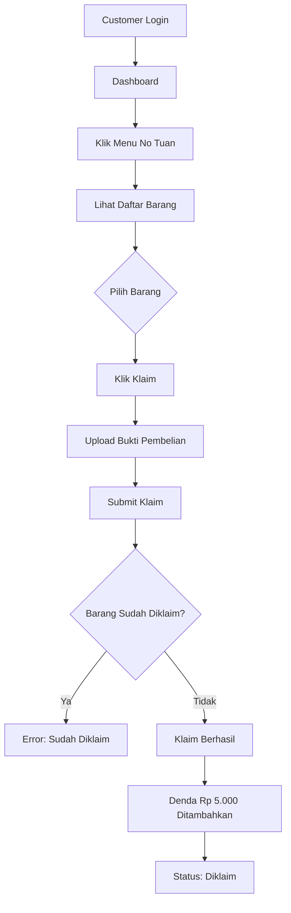
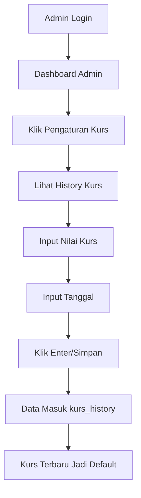
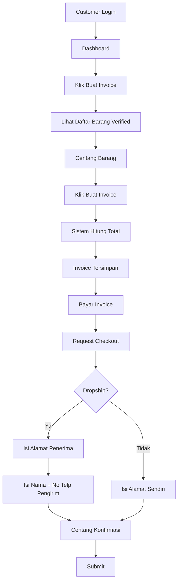
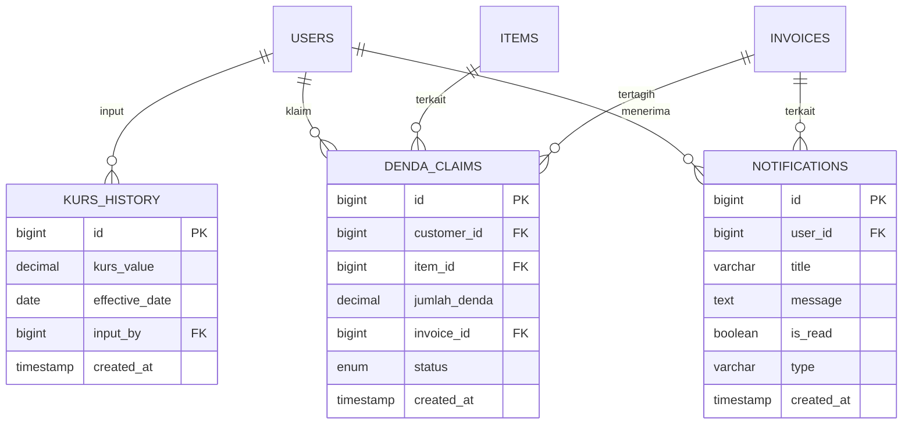

# REVISI PRD — Ting Warehouse Management System
# Addendum / Versi 2.1 — Juli 2026

---

> **Dokumen ini adalah lampiran revisi dari PRD Utama (PRD_TingWarehouse_Full.md — Versi 2.0).**
> **Seluruh referensi FR, halaman, database, dan flow harus dibaca berdampingan dengan PRD utama.**

---

## Daftar Isi

1. [Ringkasan Revisi](#1-ringkasan-revisi)
2. [Revisi Fitur (Functional Requirement)](#2-revisi-fitur-functional-requirement)
3. [Tabel Database Baru & Yang Diubah](#3-tabel-database-baru-yang-diubah)
4. [Revisi Navigation & Screen](#4-revisi-navigation-screen)
5. [Revisi API Design](#5-revisi-api-design)
6. [Revisi User Flow](#6-revisi-user-flow)
7. [Revisi Form Specification](#7-revisi-form-specification)
8. [Revisi Error/Success/Warning Messages](#8-revisi-messages)
9. [Revisi Database Design (ERD)](#9-revisi-erd)
10. [Mapping Revisi ke PRD Utama](#10-mapping-revisi)
11. [Impact Analysis](#11-impact-analysis)

---

# 1. Ringkasan Revisi

## 1.1 Info Dokumen

| Item | Detail |
|------|--------|
| **Dokumen Asal** | PRD_TingWarehouse_Full.md — Versi 2.0 (Juli 2026) |
| **Dokumen Revisi** | PRD_TingWarehouse_Revisi.md — Versi 2.1 (Juli 2026) |
| **Sumber Revisi** | Review client via PDF (website review.pdf) |
| **Status** | Revisi dari client — menunggu approval |

## 1.2 Ringkasan Perubahan

| No | Kategori | Jumlah Item |
|----|----------|-------------|
| 1 | Fitur Baru (Belum ada di PRD) | 10 fitur |
| 2 | Fitur yang Diubah | 3 fitur |
| 3 | Fitur yang Sudah Sesuai | 4 fitur |
| 4 | Tabel Database Baru | 3 tabel |
| 5 | Tabel Database yang Diubah | 2 tabel |
| 6 | API Endpoint Baru | 12 endpoint |
| 7 | Halaman Baru | 5 halaman |

---

# 2. Revisi Fitur (Functional Requirement)

## 2.1 FITUR BARU: FR-017 — No Tuan (Barang Tidak Di-klaim)

> **Referensi PRD:** Tidak ada di PRD utama. Ini adalah fitur **100% baru**.

### 2.1.1 Definisi

"No Tuan" adalah kondisi di mana barang yang tiba di gudang/warehouse tidak diklaim oleh customer mana pun. Barang ini perlu ditandai agar bisa dijual kembali atau dilelang.

### 2.1.2 Business Rules

1. Barang masuk kategori "No Tuan" jika:
   - Customer tidak mengklaim barang dalam waktu X hari setelah box datang
   - Atau barang tidak terdaftar di setor resi customer mana pun
2. Barang No Tuan bisa di-klaim oleh customer dengan **upload bukti pembelian**
3. Klaim barang dikenakan **denda Rp 5.000** per item
4. Denda ditagih bersamaan dengan pembayaran invoice berikutnya
5. Barang yang sudah masuk status "Klaim WH" **tidak bisa di-klaim lagi**

### 2.1.3 Flow No Tuan

```
1. Admin melihat daftar barang di box yang belum ada customer-nya
2. Admin menandai barang sebagai "No Tuan"
3. Barang muncul di daftar "No Tuan" di dashboard admin
4. Customer melihat daftar "No Tuan" di dashboard mereka
5. Customer klik barang → Klik "Klaim"
6. Customer upload bukti pembelian (foto nota/resi beli)
7. Sistem cek: apakah barang sudah diklaim orang lain?
8. Jika belum → Klaim berhasil, status berubah ke "Diklaim"
9. Denda Rp 5.000 otomatis ditambahkan ke tagihan customer
10. Jika sudah diklaim → Error: "Barang sudah diklaim oleh customer lain"
```

### 2.1.4 Validasi Klaim

| Field | Rule | Error Message |
|-------|------|---------------|
| bukti_pembelian | required, file, mimes:jpg,png, max:5MB | "Upload bukti pembelian (foto nota/resi)" |
| barang_id | required, exists:items | "Barang tidak ditemukan" |
| status barang | harus "no_tuan" | "Barang sudah diklaim atau tidak tersedia" |

### 2.1.5 Acceptance Criteria

- [ ] Admin bisa menandai barang sebagai "No Tuan"
- [ ] Customer bisa melihat daftar "No Tuan" di dashboard
- [ ] Customer bisa klaim barang dengan upload bukti
- [ ] Denda Rp 5.000 otomatis ditambahkan
- [ ] Barang yang sudah di-klaim tidak bisa di-klaim lagi
- [ ] Status "Klaim WH" tidak bisa di-klaim

---

## 2.2 FITUR BARU: FR-018 — History Kurs

> **Referensi PRD:** Section 4.12 FR-012 (Pengaturan Rate) — **diubah dari single value menjadi history-based**.

### 2.2.1 Definisi

Kurs Yuan → Rupiah berubah setiap hari. Sistem harus menyimpan **history kurs** beserta tanggal inputnya, sehingga:
- Perhitungan biaya bisa dilakukan dengan kurs pada saat transaksi terjadi
- Admin/Owner bisa melihat riwayat perubahan kurs
- Laporan keuangan bisa menggunakan kurs historis

### 2.2.2 Perubahan dari PRD Utama

| Aspek | PRD Utama (v2.0) | Revisi (v2.1) |
|-------|------------------|---------------|
| Kurs | Single value di settings | **History-based** (kurs + tanggal) |
| Input | Admin update value | Admin input "Kurs + Tanggal = Enter" |
| Penyimpanan | Tabel settings | **Tabel baru: kurs_history** |
| Perhitungan | Pakai kurs terbaru | **Pakai kurs pada tanggal transaksi** |

### 2.2.3 Tabel Baru: `kurs_history`

| Kolom | Tipe | Keterangan |
|-------|------|------------|
| id | bigint PK | Auto increment |
| kurs_value | decimal(10,2) | Nilai kurs (contoh: 2660) |
| effective_date | date | Tanggal berlaku kurs |
| input_by | bigint FK→users | Admin/Owner yang input |
| created_at | timestamp | Waktu input |

### 2.2.4 Flow History Kurs

```
Admin/Owner:
1. Buka halaman Pengaturan Kurs
2. Input nilai kurs (contoh: 2660)
3. Input tanggal berlaku (contoh: 26 September 2026)
4. Klik Enter / Simpan
5. Data masuk ke tabel kurs_history
6. Kurs terbaru otomatis jadi default untuk transaksi baru

Customer:
1. Di dashboard, melihat "Kurs Hari Ini: Rp 2.660"
2. Saat bayar invoice, sistem pakai kurs pada tanggal invoice dibuat
```

### 2.2.5 Acceptance Criteria

- [ ] Admin bisa input kurs + tanggal
- [ ] History kurs tersimpan dan bisa dilihat
- [ ] Kurs terbaru jadi default untuk transaksi baru
- [ ] Invoice lama tetap pakai kurs saat invoice dibuat
- [ ] Customer melihat kurs terkini di dashboard

---

## 2.3 FITUR BARU: FR-019 — Manage Box Close/Open + Last Setor

> **Referensi PRD:** Section 4.9 FR-009 (Manage Box) — **ditambah fitur close/open dan status last setor**.

### 2.3.1 Definisi

Admin bisa menutup (close) box agar customer tidak bisa lagi menambah barang (setor resi). Box yang sudah close tetap bisa diakses untuk melihat data, tapi input baru ditolak.

### 2.3.2 Perubahan dari PRD Utama

| Aspek | PRD Utama (v2.0) | Revisi (v2.1) |
|-------|------------------|---------------|
| Status Box | 5 status (OPEN → DONE) | **+ 2 status: CLOSED, LAST_SETOR** |
| Setor Resi | Selalu bisa selama box ada | **Ditolak jika box CLOSED** |
| Info Box | Tidak ada info waktu | **+ open_date, close_date, last_setor_date** |

### 2.3.3 Status Box yang Diubah

| Status | Keterangan |
|--------|------------|
| OPEN | Box terbuka, bisa setor resi |
| CLOSED | Box ditutup, setor resi ditolak |
| LAST_SETOR | Status terakhir sebelum close (info kapan terakhir kali customer setor) |
| SENT TO CARGO | Sudah dikirim dari China |
| OTW INA | Dalam perjalanan ke Indonesia |
| UP INVOICE | Invoice sudah dibuat |
| DONE | Selesai |

### 2.3.4 Kolom Baru di Tabel `boxes`

| Kolom | Tipe | Default | Keterangan |
|-------|------|---------|------------|
| open_date | timestamp | null | Kapan box dibuka |
| close_date | timestamp | null | Kapan box ditutup |
| last_setor_date | timestamp | null | Kapan terakhir kali ada setor resi |

### 2.3.5 Flow Close/Open Box

```
Admin:
1. Buka Manage Box
2. Klik box yang ingin ditutup
3. Klik "Tutup Box" (Close)
4. Konfirmasi: "Box akan ditutup. Customer tidak bisa setor lagi."
5. Status: OPEN → CLOSED
6. close_date = waktu sekarang

Customer:
1. Buka Setor Resi
2. Pilih box
3. Jika box status CLOSED → Error: "Box sudah ditutup. Tidak bisa menambah barang."
4. Jika box status OPEN → Bisa setor

Admin:
1. Jika perlu buka kembali → Klik "Buka Box" (Open)
2. Status: CLOSED → OPEN
```

### 2.3.6 Acceptance Criteria

- [ ] Admin bisa close/open box
- [ ] Customer tidak bisa setor resi ke box yang sudah close
- [ ] Info open_date, close_date, last_setor_date tersimpan
- [ ] Customer melihat info kapan box dibuka/ditutup

---

## 2.4 FITUR BARU: FR-020 — Denda Klaim Barang

> **Referensi PRD:** Section 4.7 FR-007 (Komplain) — **ditambah kategori denda**.

### 2.4.1 Definisi

Setiap klaim barang (No Tuan atau barang terlambat di-klaim) dikenakan denda Rp 5.000 per item. Denda ditagih bersamaan dengan pembayaran invoice berikutnya.

### 2.4.2 Business Rules

1. Denda = Rp 5.000 per barang yang di-klaim
2. Denda otomatis ditambahkan ke invoice customer
3. Denda tidak bisa dibatalkan setelah klaim disetujui
4. Denda tercatat di tabel `denda_claims` untuk audit

### 2.4.3 Tabel Baru: `denda_claims`

| Kolom | Tipe | Keterangan |
|-------|------|------------|
| id | bigint PK | Auto increment |
| customer_id | bigint FK→users | Customer yang klaim |
| item_id | bigint FK→items | Barang yang diklaim |
| jumlah_denda | decimal(10,2) | Default: 5000 |
| invoice_id | bigint FK→invoices | Invoice terkait (null jika belum ditagih) |
| status | enum | pending / tagged / paid |
| created_at | timestamp | Waktu klaim |

### 2.4.4 Flow Denda

```
1. Customer klaim barang No Tuan
2. Sistem cek: apakah barang valid?
3. Jika valid → Klaim berhasil
4. Sistem buat entri denda_claims: customer_id, item_id, jumlah=5000, status=pending
5. Saat generate invoice berikutnya, denda otomatis ditambahkan ke Add On
6. Invoice menampilkan: "Denda Klaim: Rp 5.000"
7. Customer bayar → denda status: tagged → paid
```

### 2.4.5 Acceptance Criteria

- [ ] Denda Rp 5.000 otomatis saat klaim
- [ ] Denda masuk ke invoice berikutnya
- [ ] Denda tercatat di tabel denda_claims
- [ ] Customer melihat rincian denda di invoice

---

## 2.5 FITUR BARU: FR-021 — Barang "Klaim WH" (Tidak Bisa Diklaim)

> **Referensi PRD:** Section 4.9 FR-009 (Manage Box) — **ditambah status baru**.

### 2.5.1 Definisi

Barang yang sudah terlalu lama di warehouse dan sudah di-klaim oleh WH untuk dijual/lelang tidak bisa di-klaim lagi oleh customer.

### 2.5.2 Status Barang yang Diubah

| Status | Keterangan | Bisa Diklaim? |
|--------|-----------|---------------|
| active | Barang aktif, menunggu diambil | Ya |
| no_tuan | Barang tidak ada pemilik | Ya (dengan denda) |
| claimed | Sudah diklaim customer | Tidak |
| **klaim_wh** | **Di-klaim oleh WH untuk dijual/lelang** | **Tidak** |
| shipped | Sudah dikirim ke customer | Tidak |

### 2.5.3 Flow Klaim WH

```
1. Admin melihat barang yang sudah melewati deadline
2. Admin menandai barang sebagai "Klaim WH" untuk dijual/lelang
3. Status barang: active/no_tuan → klaim_wh
4. Barang muncul di daftar "Barang untuk Dijual/Lelang"
5. Customer tidak bisa klaim barang ini lagi
```

---

## 2.6 FITUR BARU: FR-022 — Info Box Sharing (Buka/Tutup)

> **Referensi PRD:** Section 8.5 Screen Specification (My Box Sharing) — **ditambah info waktu**.

### 2.6.1 Definisi

Customer bisa melihat kapan box sharing dibuka dan kapan ditutup untuk setor resi.

### 2.6.2 Tampilan di My Box Sharing

```
┌─────────────────────────────────────────┐
│ Box 260 SEA - Sharing                   │
│ Status: OPEN                            │
│ Dibuka: 1 September 2026               │
│ Ditutup: 15 September 2026 (estimasi)  │
│ Barang: 12 item                         │
│ Berat Total: 156.5 kg                   │
└─────────────────────────────────────────┘
```

### 2.6.3 Acceptance Criteria

- [ ] Customer melihat tanggal box dibuka
- [ ] Customer melihat tanggal/tenggat box ditutup
- [ ] Info tampil di halaman My Box Sharing

---

## 2.7 FITUR BARU: FR-023 — Rekap Data (Customer + WH China)

> **Referensi PRD:** Section 4.16 FR-016 (Recap) — **signifikan diubah**.

### 2.7.1 Definisi

Halaman rekap menampilkan data dari 2 sumber:
1. **Data Customer** — dari form setor resi yang diinput customer
2. **Data WH China** — dari warehouse China yang diinput admin

Rekap memudahkan admin mencocokkan data customer dengan data actual dari warehouse China.

### 2.7.2 Perubahan dari PRD Utama

| Aspek | PRD Utama (v2.0) | Revisi (v2.1) |
|-------|------------------|---------------|
| Recap | Input tracking + assign ke box | **Dual-source: Customer data + WH China data** |
| Kolom | Tracking, foto, resi | **+ Kolom WH China (berat, ukuran, biaya jasa)** |
| Integrasi | Manual | **Auto-detect match antara data customer dan WH China** |

### 2.7.3 Tampilan Rekap

| Kolom | Sumber | Keterangan |
|-------|--------|------------|
| No Resi | Customer | Dari form setor resi |
| Nama Barang | Customer | Dari form setor resi |
| Jumlah | Customer | Dari form setor resi |
| Harga (Yuan) | Customer | Dari form setor resi |
| **Berat (kg)** | **WH China** | **Diinput admin dari data WH China** |
| **Ukuran Box** | **WH China** | **Diinput admin dari data WH China** |
| **Biaya Jasa** | **WH China** | **Diinput admin (tidak terlihat customer)** |
| Status | Sistem | Matched / Unmatched / Verified |

### 2.7.4 Flow Rekap

```
1. Customer submit setor resi → Data masuk ke tabel rekap (sumber: customer)
2. Admin terima data dari WH China → Input berat, ukuran, biaya jasa
3. Sistem auto-detect: cocokkan No Resi customer dengan data WH China
4. Jika cocok → Status: "Matched" (data lengkap)
5. Jika belum cocok → Status: "Unmatched" (menunggu data WH China)
6. Admin bisa melihat: data customer yang belum ada datanya dari WH China
7. Admin bisa melihat: data WH China yang belum ada customer-nya (No Tuan)
```

### 2.7.5 Acceptance Criteria

- [ ] Tabel rekap menampilkan 2 sumber data
- [ ] Auto-detect match berdasarkan No Resi
- [ ] Status: Matched / Unmatched
- [ ] Biaya jasa WH China tidak terlihat customer
- [ ] Admin bisa input data WH China

---

## 2.8 FITUR BARU: FR-024 — Invoice Fleksibel (Shopee-style)

> **Referensi PRD:** Section 4.5 FR-005 (Invoice) — **signifikan diubah**.

### 2.8.1 Definisi

Customer bisa memilih **barang mana saja** yang ingin dijadikan 1 invoice, mirip dengan fitur keranjang belanja di Shopee. Ini karena customer bisa dropship dan ingin mengirim beberapa barang sekaligus.

### 2.8.2 Perubahan dari PRD Utama

| Aspek | PRD Utama (v2.0) | Revisi (v2.1) |
|-------|------------------|---------------|
| Invoice | Auto-generated per box | **Customer pilih barang untuk invoice** |
| Checkout | Pilih invoice → alamat | **Pilih invoice → pilih alamat (personal/dropship)** |
| Dropship | Ada field nama/no telp | **+ Field "Pengirim" (nama & no telp customer)** |

### 2.8.3 Flow Invoice Fleksibel

```
Customer:
1. Buka halaman "Buat Invoice"
2. Lihat daftar barang yang sudah verified (dari WH China)
3. Centang barang-barang yang ingin dijadikan 1 invoice
4. Klik "Buat Invoice"
5. Sistem hitung total: berat, volume, fee TAX, fee WH, fee packing
6. Invoice tersimpan

Checkout:
1. Pilih invoice yang sudah dibayar
2. Pilih tipe: Personal atau Dropship
3. Jika Dropship:
   - Isi nama penerima
   - Isi no telp penerima
   - Isi alamat penerima
   - Isi nama & no telp PENGIRIM (customer)
4. Centang konfirmasi
5. Submit
```

### 2.8.4 Kolom Baru di Tabel `checkouts`

| Kolom | Tipe | Keterangan |
|-------|------|------------|
| sender_name | varchar | Nama pengirim (untuk dropship) |
| sender_phone | varchar | No telp pengirim (untuk dropship) |

### 2.8.5 Acceptance Criteria

- [ ] Customer bisa pilih barang untuk invoice
- [ ] Customer bisa buat invoice dari beberapa barang
- [ ] Checkout dropship ada field pengirim
- [ ] Hitungan biaya otomatis

---

## 2.9 FITUR BARU: FR-025 — Data Barang Klaim/Lelang

> **Referensi PRD:** Tidak ada di PRD utama. Fitur **100% baru**.

### 2.9.1 Definisi

Daftar barang yang sudah di-klaim oleh WH untuk dijual kembali atau dilelang. Admin bisa melihat, filter, dan export data ini.

### 2.9.2 Halaman Baru: `/admin/lelang`

| Komponen | Deskripsi |
|----------|-----------|
| Filter | Status (Klaim WH, Dijual, Lelang), Tanggal, Customer |
| Tabel | Nama Barang, No Resi, Berat, Harga Asli, Status, Tanggal Klaim |
| Tombol | Export Excel, Tandai "Dijual", Tandai "Lelang" |
| Summary | Total barang, Total nilai, Barang belum terjual |

### 2.9.3 Acceptance Criteria

- [ ] Admin bisa melihat daftar barang klaim/lelang
- [ ] Filter berdasarkan status dan tanggal
- [ ] Export ke Excel
- [ ] Tandai status jual/lelang

---

## 2.10 FITUR BARU: FR-026 — Deadline Pembayaran & Nimbun

> **Referensi PRD:** Section 4.14 FR-014 (Info Customer & Deadline) — **ditambah fitur deadline aktif**.

### 2.10.1 Definisi

Sistem memiliki 2 jenis deadline:
1. **Deadline Pembayaran** — batas waktu customer membayar invoice
2. **Deadline "Nimbun"** — berapa lama barang boleh disimpan di warehouse

### 2.10.2 Business Rules

| Deadline | Default | Keterangan |
|----------|---------|------------|
| Deadline Pembayaran | 7 hari setelah invoice | Hitung dari tanggal invoice |
| Deadline Nimbun | 30 hari setelah barang sampai | Barang boleh di-WH max 30 hari |
| **Barang tidak diambil > 2 minggu dari tagihan** | **Auto hold** | **Barang ditahan, bisa dilelang** |

### 2.10.3 Notifikasi Reminder

| Waktu | Notifikasi |
|-------|-----------|
| 3 hari sebelum deadline | Reminder: "Invoice akan jatuh tempo dalam 3 hari" |
| 1 hari sebelum deadline | Warning: "Invoice jatuh tempo besok!" |
| Deadline hari | Alert: "Invoice sudah jatuh tempo!" |
| 2 minggu tanpa pembayaran | Alert: "Barang akan ditahan WH dan bisa dilelang" |

### 2.10.4 Kolom Baru di Tabel `invoices`

| Kolom | Tipe | Default | Keterangan |
|-------|------|---------|------------|
| payment_deadline | date | null | Deadline pembayaran |
| storage_deadline | date | null | Deadline nimbun |
| reminder_sent | boolean | false | Apakah reminder sudah dikirim |

### 2.10.5 Flow Deadline

```
1. Admin generate invoice → payment_deadline = invoice_date + 7 hari
2. Barang sampai Indonesia → storage_deadline = arrival_date + 30 hari
3. Sistem jalan cron setiap hari:
   a. Cek invoice yang mendekati deadline → kirim reminder
   cek barang yang sudah lewat storage_deadline → auto hold + notif ke admin
   c. Cek barang > 2 minggu dari tagihan belum dibayar → hold + lelang warning

4. Customer menerima notifikasi:
   "Invoice [no] jatuh tempo dalam 3 hari. Segera lakukan pembayaran."
   
5. Jika lewat deadline:
   "Barang Anda akan ditahan WH dan bisa dilelang. Hubungi admin untuk info."
```

### 2.10.6 Acceptance Criteria

- [ ] Invoice otomatis punya payment_deadline
- [ ] Barang otomatis punya storage_deadline
- [ ] Reminder otomatis terkirim
- [ ] Barang > 2 minggu tanpa bayar → auto hold
- [ ] Customer melihat deadline di dashboard

---

## 2.11 FITUR BARU: FR-027 — Reminder Notifikasi ke Customer

> **Referensi PRD:** Section 5.1 Security / Section 14 Success Messages — **ditambah notifikasi in-app**.

### 2.11.1 Definisi

Sistem mengirim notifikasi otomatis ke customer untuk berbagai kondisi penting.

### 2.11.2 Daftar Notifikasi

| Event | Target | Pesan |
|-------|--------|-------|
| Invoice baru | Customer | "Invoice [no] sudah tersedia. Total: Rp X" |
| Invoice jatuh tempo 3 hari | Customer | "Invoice [no] jatuh tempo dalam 3 hari" |
| Invoice jatuh tempo | Customer | "Invoice [no] sudah jatuh tempo" |
| Barang sampai WH | Customer | "Barang Anda sudah sampai di WH Jakarta" |
| Checkout diproses | Customer | "Barang Anda sedang diproses. Tracking: [no]" |
| Komplain diproses | Customer | "Komplain Anda sedang diproses" |
| Komplain selesai | Customer | "Komplain Anda sudah selesai: [keterangan]" |
| Box ditutup | Customer | "Box [no] sudah ditutup. Tidak bisa setor lagi." |
| Klaim berhasil | Customer | "Klaim barang berhasil. Denda: Rp 5.000" |
| Deadline nimbun 7 hari | Customer | "Barang Anda sudah 23 hari di WH. Sisa: 7 hari" |
| Deadline nimbun habis | Customer | "Barang Anda sudah melewati deadline. Akan ditahan WH." |
| Barang hold | Customer | "Barang Anda ditahan WH. Hubungi admin." |

### 2.11.3 Implementasi

- **Tabel `notifications`**: id, user_id, title, message, is_read, created_at
- **Tampilan**: Bell icon di navbar dengan badge count
- **Halaman**: `/notifications` — daftar semua notifikasi

---

## 2.12 FITUR DIUBAH: FR-012 (Revisi) — Pengaturan Rate & Kurs

> **Referensi PRD:** Section 4.12 FR-012 — **diperluas dengan history**.

### Perubahan

| Aspek | Sebelum | Sesudah |
|-------|---------|---------|
| Kurs | Single value | History-based (kurs + tanggal) |
| Input form | Input value saja | Input value + tanggal + Enter |
| Penyimpanan | Tabel settings | Tabel kurs_history |
| Default | Selalu pakai terbaru | Pakai kurs pada tanggal transaksi |

---

## 2.13 FITUR DIUBAH: FR-016 (Revisi) — Recap

> **Referensi PRD:** Section 4.16 FR-016 — **signifikan diubah**.

### Perubahan

| Aspek | Sebelum | Sesudah |
|-------|---------|---------|
| Input | Manual tracking + foto | **Dual-source: Customer + WH China** |
| Kolom | Tracking, foto, resi | **+ Berat, ukuran, biaya jasa** |
| Matching | Tidak ada | **Auto-detect match No Resi** |
| Tampilan | Tunggal | **2 panel: Data Customer + Data WH China** |

---

## 2.14 FITUR DIUBAH: FR-009 (Revisi) — Manage Box

> **Referensi PRD:** Section 4.9 FR-009 — **ditambah close/open + last setor**.

### Perubahan

| Aspek | Sebelum | Sesudah |
|-------|---------|---------|
| Status | 5 status | **+ CLOSED, LAST_SETOR** |
| Setor Resi | Selalu bisa | **Ditolak jika CLOSED** |
| Info Box | Tidak ada waktu | **+ open_date, close_date, last_setor_date** |
| Tombol | Update status | **+ Tombol Close/Open** |

---

## 2.15 FITUR YANG SUDAH SESUAI (Tidak Diubah)

| Fitur | Referensi PRD | Status |
|-------|-------------|--------|
| Customer cek status box | FR-003 (My Box) | ✅ Sesuai |
| Admin manage box (basic) | FR-009 (Manage Box) | ✅ Sesuai |
| Dashboard admin box list | Screen 8.11 | ✅ Sesuai |
| Info box di customer | Screen 8.5 | ✅ Sesuai |

---

# 3. Tabel Database Baru & Yang Diubah

## 3.1 Tabel Baru: `kurs_history`

> **Referensi PRD:** Section 18 Database Design — **tabel baru**

```sql
CREATE TABLE kurs_history (
    id BIGINT PRIMARY KEY AUTO_INCREMENT,
    kurs_value DECIMAL(10,2) NOT NULL,
    effective_date DATE NOT NULL,
    input_by BIGINT NOT NULL,
    created_at TIMESTAMP DEFAULT CURRENT_TIMESTAMP,
    FOREIGN KEY (input_by) REFERENCES users(id) ON DELETE CASCADE,
    INDEX idx_effective_date (effective_date),
    UNIQUE KEY uk_kurs_date (kurs_value, effective_date)
);
```

## 3.2 Tabel Baru: `denda_claims`

> **Referensi PRD:** Section 18 Database Design — **tabel baru**

```sql
CREATE TABLE denda_claims (
    id BIGINT PRIMARY KEY AUTO_INCREMENT,
    customer_id BIGINT NOT NULL,
    item_id BIGINT NOT NULL,
    jumlah_denda DECIMAL(10,2) DEFAULT 5000,
    invoice_id BIGINT NULL,
    status ENUM('pending', 'tagged', 'paid') DEFAULT 'pending',
    created_at TIMESTAMP DEFAULT CURRENT_TIMESTAMP,
    FOREIGN KEY (customer_id) REFERENCES users(id) ON DELETE CASCADE,
    FOREIGN KEY (item_id) REFERENCES items(id) ON DELETE CASCADE,
    FOREIGN KEY (invoice_id) REFERENCES invoices(id) ON DELETE SET NULL,
    INDEX idx_customer_status (customer_id, status)
);
```

## 3.3 Tabel Baru: `notifications`

> **Referensi PRD:** Section 18 Database Design — **tabel baru**

```sql
CREATE TABLE notifications (
    id BIGINT PRIMARY KEY AUTO_INCREMENT,
    user_id BIGINT NOT NULL,
    title VARCHAR(255) NOT NULL,
    message TEXT NOT NULL,
    is_read BOOLEAN DEFAULT FALSE,
    type VARCHAR(50) DEFAULT 'info',
    created_at TIMESTAMP DEFAULT CURRENT_TIMESTAMP,
    FOREIGN KEY (user_id) REFERENCES users(id) ON DELETE CASCADE,
    INDEX idx_user_read (user_id, is_read),
    INDEX idx_created (created_at)
);
```

## 3.4 Tabel yang Diubah: `boxes`

> **Referensi PRD:** Section 18.2 Tabel `boxes` — **ditambah kolom**

```sql
-- Kolom baru yang ditambahkan
ALTER TABLE boxes ADD COLUMN open_date TIMESTAMP NULL;
ALTER TABLE boxes ADD COLUMN close_date TIMESTAMP NULL;
ALTER TABLE boxes ADD COLUMN last_setor_date TIMESTAMP NULL;
```

## 3.5 Tabel yang Diubah: `invoices`

> **Referensi PRD:** Section 18.2 Tabel `invoices` — **ditambah kolom**

```sql
-- Kolom baru yang ditambahkan
ALTER TABLE invoices ADD COLUMN payment_deadline DATE NULL;
ALTER TABLE invoices ADD COLUMN storage_deadline DATE NULL;
ALTER TABLE invoices ADD COLUMN reminder_sent BOOLEAN DEFAULT FALSE;
```

## 3.6 Tabel yang Diubah: `checkouts`

> **Referensi PRD:** Section 18.2 Tabel `checkouts` — **ditambah kolom**

```sql
-- Kolom baru untuk dropship
ALTER TABLE checkouts ADD COLUMN sender_name VARCHAR(255) NULL;
ALTER TABLE checkouts ADD COLUMN sender_phone VARCHAR(15) NULL;
```

---

# 4. Revisi Navigation & Screen

## 4.1 Halaman Baru

| Halaman | URL | Akses | Keterangan |
|---------|-----|-------|------------|
| No Tuan | `/customer/no-tuan` | Customer | Daftar barang tidak di-klaim |
| Klaim Barang | `/customer/klaim/{id}` | Customer | Form klaim + upload bukti |
| History Kurs | `/admin/kurs-history` | Admin, Owner | Tabel history kurs |
| Barang Lelang | `/admin/lelang` | Admin, Owner | Data barang untuk dijual/lelang |
| Notifikasi | `/notifications` | Semua | Daftar notifikasi |

## 4.2 Halaman yang Diubah

| Halaman | Perubahan |
|---------|-----------|
| `/admin/boxes` | + Tombol Close/Open, info open_date, close_date |
| `/admin/recap` | + 2 panel: Data Customer + Data WH China |
| `/admin/invoices/create` | + Customer pilih barang untuk invoice (Shopee-style) |
| `/invoice/{id}/pay` | + Tampilkan denda jika ada |
| `/checkout` | + Field sender_name, sender_phone untuk dropship |
| `/box/sharing` | + Info kapan box dibuka/ditutup |
| `/admin/settings` | + History kurs |

## 4.3 Navbar yang Diubah

### Customer Navbar

| Sebelum | Sesudah |
|---------|---------|
| Dashboard | Dashboard |
| My Box | My Box |
| Setor Resi | Setor Resi |
| Invoice | Invoice |
| Checkout | Checkout |
| Komplain | Komplain |
| Kalkulator | Kalkulator |
| - | **No Tuan** ← baru |
| - | **Notifikasi** (bell icon) ← baru |

### Admin Navbar

| Sebelum | Sesudah |
|---------|---------|
| Dashboard | Dashboard |
| Manage Box | Manage Box |
| Recap | Recap |
| Invoice | Invoice |
| Verification | Verification |
| Checkout | Checkout |
| Customers | Customers |
| Complains | Complains |
| Est Update | Est Update |
| Settings | Settings |
| - | **Kurs History** ← baru |
| - | **Barang Lelang** ← baru |
| - | **Notifikasi** (bell icon) ← baru |

---

# 5. Revisi API Design

## 5.1 Endpoint Baru

| Endpoint | Method | Auth | Description |
|----------|--------|------|-------------|
| `/api/no-tuan` | GET | Customer | Daftar barang No Tuan |
| `/api/no-tuan/{id}/claim` | POST | Customer | Klaim barang |
| `/api/kurs-history` | GET | Admin, Owner | History kurs |
| `/api/kurs-history` | POST | Admin, Owner | Input kurs baru |
| `/api/boxes/{id}/close` | POST | Admin | Tutup box |
| `/api/boxes/{id}/open` | POST | Admin | Buka box |
| `/api/recap/wh-china` | POST | Admin | Input data WH China |
| `/api/invoices/create-flexible` | POST | Customer | Buat invoice fleksibel |
| `/api/lelang` | GET | Admin, Owner | Daftar barang lelang |
| `/api/lelang/{id}/status` | PUT | Admin | Update status lelang |
| `/api/notifications` | GET | Semua | Daftar notifikasi |
| `/api/notifications/{id}/read` | PUT | Semua | Tandai sudah dibaca |

## 5.2 Endpoint yang Diubah

| Endpoint | Perubahan |
|----------|-----------|
| POST `/api/sensor-data` | + Cek box status (CLOSED = tolak setor) |
| POST `/api/invoices` | + Support flexible item selection |
| POST `/api/checkouts` | + Field sender_name, sender_phone |

---

# 6. Revisi User Flow

## 6.1 Flow Baru: Klaim Barang No Tuan



## 6.2 Flow Baru: Input Kurs History



## 6.3 Flow Baru: Invoice Fleksibel



---

# 7. Revisi Form Specification

## 7.1 Form Klaim Barang (Baru)

| Field | Type | Required | Max | Keterangan |
|-------|------|----------|-----|------------|
| item_id | hidden | Ya | - | ID barang |
| bukti_pembelian | file | Ya | 5MB | jpg, png |
| keterangan | textarea | Tidak | 500 | Catatan tambahan |

## 7.2 Form Input Kurs (Diubah)

| Field | Type | Required | Keterangan |
|-------|------|----------|------------|
| kurs_value | number | Ya | Nilai kurs |
| effective_date | date | Ya | Tanggal berlaku |

## 7.3 Form Checkout (Diubah)

| Field | Type | Required | Keterangan |
|-------|------|----------|------------|
| invoice_id | select | Ya | Invoice sudah verified |
| address_type | radio | Ya | Personal / Dropship |
| recipient_name | text | Ya | Nama penerima |
| recipient_phone | text | Ya | No telp penerima |
| address | textarea | Ya | Alamat |
| sender_name | text | Ya jika dropship | Nama pengirim |
| sender_phone | text | Ya jika dropship | No telp pengirim |
| confirmation | checkbox | Ya | Konfirmasi |

## 7.4 Form Input Data WH China (Baru)

| Field | Type | Required | Keterangan |
|-------|------|----------|------------|
| resi_number | text | Ya | No resi (untuk match) |
| berat | number | Ya | Berat dalam kg |
| ukuran_box | text | Ya | Dimensi box |
| biaya_jasa | number | Tidak | Tidak terlihat customer |
| foto_barang | file | Tidak | Foto dari WH China |

---

# 8. Revisi Messages

## 8.1 Error Messages Baru

| Kondisi | Pesan | HTTP Code |
|---------|-------|-----------|
| Box sudah CLOSED | "Box sudah ditutup. Tidak bisa menambah barang." | 422 |
| Barang sudah diklaim | "Barang sudah diklaim oleh customer lain." | 422 |
| Bukti pembelian kosong | "Upload bukti pembelian." | 422 |
| Kurs sudah ada di tanggal itu | "Kurs untuk tanggal ini sudah ada." | 422 |
| Deadline lewat | "Barang sudah melewati deadline. Hubungi admin." | 422 |
| Barang hold | "Barang ditahan WH. Tidak bisa checkout." | 422 |

## 8.2 Success Messages Baru

| Aksi | Pesan |
|------|-------|
| Klaim berhasil | "Barang berhasil diklaim. Denda Rp 5.000 ditambahkan." |
| Kurs diupdate | "Kurs berhasil diupdate." |
| Box ditutup | "Box berhasil ditutup." |
| Box dibuka | "Box berhasil dibuka." |
| Data WH diinput | "Data WH China berhasil diinput." |
| Invoice fleksibel | "Invoice berhasil dibuat." |

## 8.3 Warning Messages Baru

| Kondisi | Pesan |
|---------|-------|
| Close box | "Customer tidak bisa setor lagi setelah box ditutup. Lanjutkan?" |
| Klaim barang | "Klaim akan dikenakan denda Rp 5.000. Lanjutkan?" |
| Deadline 3 hari | "Invoice jatuh tempo dalam 3 hari!" |
| Deadline nimbun | "Barang sudah 23 hari di WH. Sisa 7 hari sebelum ditahan." |
| Barang hold | "Barang akan ditahan dan bisa dilelang. Hubungi admin." |

---

# 9. Revisi ERD



---

# 10. Mapping Revisi ke PRD Utama

| Revisi | FR Baru/Diubah | Section PRD Utama | Impact |
|--------|---------------|-------------------|--------|
| No Tuan + Klaim | FR-017 | Tidak ada (baru) | Database baru, halaman baru |
| History Kurs | FR-018 | 4.12 FR-012 | Database baru, form diubah |
| Manage Box Close/Open | FR-019 | 4.9 FR-009 | Database diubah, flow diubah |
| Denda Klaim | FR-020 | Tidak ada (baru) | Database baru |
| Klaim WH | FR-021 | 4.9 FR-009 | Status baru |
| Info Box Waktu | FR-022 | 8.5 Screen | Kolom baru |
| Rekap Dual-Source | FR-023 | 4.16 FR-016 | Flow signifikan diubah |
| Invoice Fleksibel | FR-024 | 4.5 FR-005 | Flow signifikan diubah |
| Barang Lelang | FR-025 | Tidak ada (baru) | Halaman baru |
| Deadline + Reminder | FR-026 | 4.14 FR-014 | Database diubah, cron job |
| Notifikasi | FR-027 | Tidak ada (baru) | Database baru, halaman baru |

---

# 11. Impact Analysis

## 11.1 Estimasi Tambahan Development

| Fitur | Estimasi Waktu | Prioritas |
|-------|---------------|-----------|
| FR-017 No Tuan + Klaim | 2-3 hari | P1 |
| FR-018 History Kurs | 1-2 hari | P1 |
| FR-019 Manage Box Close/Open | 1-2 hari | P1 |
| FR-020 Denda Klaim | 1 hari | P1 |
| FR-021 Klaim WH | 0.5 hari | P2 |
| FR-022 Info Box Waktu | 0.5 hari | P3 |
| FR-023 Rekap Dual-Source | 3-4 hari | P2 |
| FR-024 Invoice Fleksibel | 3-4 hari | P1 |
| FR-025 Barang Lelang | 1-2 hari | P2 |
| FR-026 Deadline + Reminder | 2-3 hari | P2 |
| FR-027 Notifikasi | 2-3 hari | P3 |
| **Total** | **17-25 hari** | - |

## 11.2 Database Changes Summary

| Tabel | Status | Kolom Ditambah |
|-------|--------|----------------|
| kurs_history | **BARU** | - |
| denda_claims | **BARU** | - |
| notifications | **BARU** | - |
| boxes | Diubah | open_date, close_date, last_setor_date |
| invoices | Diubah | payment_deadline, storage_deadline, reminder_sent |
| checkouts | Diubah | sender_name, sender_phone |

## 11.3 Risk

| Risk | Mitigation |
|------|-----------|
| Invoice fleksibel kompleks | Prototype dulu, test dengan kasus dropship |
| Deadline reminder perlu cron job | Setup scheduler di Laravel |
| Integrasi data WH China | Butuh API atau form manual dari admin |
| Denda klaim perlu tagihan otomatis | Integrasi dengan generate invoice |

---

> **END OF REVISI DOCUMENT**
> 
> Dokumen ini harus dibaca berdampingan dengan PRD_TingWarehouse_Full.md (Versi 2.0).
> Seluruh FR, halaman, database, dan flow harus mengacu pada kedua dokumen.
> 
> Terakhir diperbarui: Juli 2026
